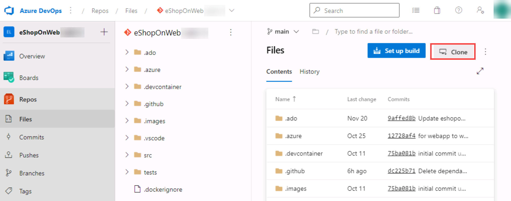

## Lab requirements

- This lab requires **Microsoft Edge** or an [Azure DevOps supported browser.](https://docs.microsoft.com/en-us/azure/devops/server/compatibility?view=azure-devops#web-portal-supported-browsers)

- **Set up an Azure DevOps organization:** If you don't already have an Azure DevOps organization that you can use for this lab, create one by following the instructions available at [Create an organization or project collection](https://docs.microsoft.com/en-us/azure/devops/organizations/accounts/create-organization?view=azure-devops).

- If you don't have Git 2.29.2 or later installed yet, start a web browser, navigate to the [Git for Windows download page](https://gitforwindows.org/) download it, and install it.
- If you don't have Visual Studio Code installed yet, from the web browser window, navigate to the [Visual Studio Code download page](https://code.visualstudio.com/), download it, and install it.
- If you don't have Visual Studio C# extension installed yet, in the web browser window, navigate to the [C# extension installation page](https://marketplace.visualstudio.com/items?itemName=ms-dotnettools.csharp) and install it.

## Lab overview

Azure DevOps supports two types of version control, Git and Team Foundation Version Control (TFVC). Here's a quick overview of the two version control systems:

- **Team Foundation Version Control (TFVC)**: TFVC is a centralized version control system. Typically, team members have only one version of each file on their dev machines. Historical data is maintained only on the server. Branches are path-based and created on the server.

- **Git**: Git is a distributed version control system. Git repositories can live locally (on a developer's machine). Each developer has a copy of the source repository on their dev machine. Developers can commit each set of changes on their dev machine and perform version control operations such as history and compare without a network connection.

Git is the default version control provider for new projects. You should use Git for version control in your projects unless you need centralized version control features in TFVC.

In this lab, you'll learn to establish a local Git repository, which can easily be synchronized with a centralized Git repository in Azure DevOps. In addition, you'll learn about Git branching and merging support. You'll use Visual Studio Code, but the same processes apply to using any Git-compatible client.

## Objectives

After you complete this lab, you will be able to:

- Clone an existing repository.
- Save work with commits.
- Review history of changes.
- Work with branches by using Visual Studio Code.

## Estimated timing: 60 minutes

## Instructions

### Exercise 0: Configure the lab prerequisites

In this exercise, you will set up the prerequisites for the lab, which consist of a new Azure DevOps project with a repository based on the [eShopOnWeb](https://github.com/MicrosoftLearning/eShopOnWeb).

#### Task 1: (skip if done) Create and configure the team project

In this task, you will create an **eShopOnWeb** Azure DevOps project to be used by several labs.

1. <input type="checkbox" class="box" id="az400-lab02-exer0-task1-01" name="az400-lab02-exer0-task1-01" /> On your lab computer, in a browser window open your Azure DevOps organization. Click on **New Project**. Give your project the name **eShopOnWeb**<button style="font-size:7px;" onclick="posttoclip('eshoponweb')">Copy</button> and choose **Scrum** on the **Work Item process** dropdown. Click on **Create**.

    

#### Task 2: (skip if done) Import eShopOnWeb Git Repository

In this task you will import the eShopOnWeb Git repository that will be used by several labs.

1. <input type="checkbox" class="box" id="az400-lab02-exer0-task2-01" name="az400-lab02-exer0-task2-01" />  On your lab computer, in a browser window open your Azure DevOps organization and the previously created **eShopOnWeb** project. Click on **Repos>Files** , **Import**. On the **Import a Git Repository** window, paste the following URL `https://github.com/MicrosoftLearning/eShopOnWeb.git`<button style="font-size:7px;" onclick="posttoclip('mslearneshoponweb')">Copy</button> and click on **Import**:

    

2. <input type="checkbox" class="box" id="az400-lab02-exer0-task2-02" name="az400-lab02-exer0-task2-02" />  The repository is organized the following way:
    - **.ado** folder contains Azure DevOps YAML pipelines
    - **.devcontainer** folder container setup to develop using containers (either locally in VS Code or GitHub Codespaces)
    - **.azure** folder contains Bicep&ARM infrastructure as code templates used in some lab scenarios.
    - **.github** folder container YAML GitHub workflow definitions.
    - **src** folder contains the .NET 6 website used on the lab scenarios.

#### Task 3: Configure Git and Visual Studio Code

In this task, you will install and configure Git and Visual Studio Code, including configuring the Git credential helper to securely store the Git credentials used to communicate with Azure DevOps. If you have already implemented these prerequisites, you can proceed directly to the next task.

1. <input type="checkbox" class="box" id="az400-lab02-exer0-task3-01" name="az400-lab02-exer0-task3-01" /> On the lab computer, open **Visual Studio Code**.
2. <input type="checkbox" class="box" id="az400-lab02-exer0-task3-02" name="az400-lab02-exer0-task3-02" /> In the Visual Studio Code interface, from the main menu, select **Terminal \| New Terminal** to open the **TERMINAL** pane.
3. <input type="checkbox" class="box" id="az400-lab02-exer0-task3-03" name="az400-lab02-exer0-task3-03" /> Make sure that the current Terminal is running **PowerShell** by checking if the drop-down list at the top right corner of the **TERMINAL** pane shows **1: powershell**

    > **Note**: To change the current Terminal shell to **PowerShell** click the drop-down list at the top right corner of the **TERMINAL** pane and click **Select Default Shell**. At the top of the Visual Studio Code window select your preferred terminal shell **Windows PowerShell** and click the plus sign on the right-hand side of the drop-down list to open a new terminal with the selected default shell.

4. <input type="checkbox" class="box" id="az400-lab02-exer0-task3-04" name="az400-lab02-exer0-task3-04" /> In the **TERMINAL** pane, run the following command below to configure the credential helper.

   

   <code id="az400-lab02-exer0-task3-04-code">git config --global credential.helper wincred</code>
   <button style="font-size:7px;" onclick="posttoclip('az400-lab02-exer0-task3-04-code')">Copy</button>

5. <input type="checkbox" class="box" id="az400-lab02-exer0-task3-05" name="az400-lab02-exer0-task3-05" /> In the **TERMINAL** pane, run the following commands to configure a user name and email for Git commits (replace the placeholders in braces with your preferred user name and email eliminating the < and > symbols):

   

   <button style="font-size:7px;" onclick="posttoclip('az400-lab02-exer0-task3-05-code')">Copy</button>
   <pre><code id="az400-lab02-exer0-task3-05-code">git config --global user.name "<var>&lt;John Doe&gt;</var>"
   git config --global user.email <var>&lt;johndoe@example.com&gt;</var></code></pre>
   

### Exercise 1: Clone an existing repository

In this exercise, you use Visual Studio Code to clone the Git repository you provisioned as part of the previous exercise.

#### Task 1: Clone an existing repository

In this task, you will step through the process of cloning a Git repository by using Visual Studio Code.

1. <input type="checkbox" class="box" id="az400-lab02-exer1-task1-01" name="az400-lab02-exer1-task1-01" /> Switch to the the web browser displaying your Azure DevOps organization with the **eShopOnWeb** project you generated in the previous exercise.
2. <input type="checkbox" class="box" id="az400-lab02-exer1-task1-02" name="az400-lab02-exer1-task1-02" /> In the vertical navigational pane of the Azure DevOps portal, select the **Repos** icon.

3. <input type="checkbox" class="box" id="az400-lab02-exer1-task1-03" name="az400-lab02-exer1-task1-03" /> In the upper right corner of the **eShopOnWeb** repository pane, click **Clone**.

    

    > **Note**: Getting a local copy of a Git repo is called *cloning*. Every mainstream development tool supports this and will be able to connect to Azure Repos to pull down the latest source to work with.

4. <input type="checkbox" class="box" id="az400-lab02-exer1-task1-04" name="az400-lab02-exer1-task1-04" /> On the **Clone Repository** panel, with the **HTTPS** Command line option selected, click the **Copy to clipboard** button next to the repo clone URL.

    > **Note**: You can use this URL with any Git-compatible tool to get a copy of the codebase.

5. <input type="checkbox" class="box" id="az400-lab02-exer1-task1-05" name="az400-lab02-exer1-task1-05" /> Close the **Clone Repository** panel.
6. <input type="checkbox" class="box" id="az400-lab02-exer1-task1-06" name="az400-lab02-exer1-task1-06" /> Switch to **Visual Studio Code** running on your lab computer.
7. <input type="checkbox" class="box" id="az400-lab02-exer1-task1-07" name="az400-lab02-exer1-task1-07" /> Click the **View** menu header and, in the drop-down menu, click **Command Palette**.

    > **Note**: The Command Palette provides an easy and convenient way to access a wide variety of tasks, including those implemented as 3rd party extensions. You can use the keyboard shortcut **Ctrl+Shift+P** or **F1** to open it.

8. <input type="checkbox" class="box" id="az400-lab02-exer1-task1-08" name="az400-lab02-exer1-task1-08" /> At the Command Palette prompt, run the **Git: Clone** command.

    

    > **Note**: To see all relevant commands, you can start by typing **Git**.

9. <input type="checkbox" class="box" id="az400-lab02-exer1-task1-09" name="az400-lab02-exer1-task1-09" /> In the **Provide repository URL or pick a repository source** text box, paste the repo clone URL you copied earlier in this task and press the **Enter** key.
10. <input type="checkbox" class="box" id="az400-lab02-exer1-task1-10" name="az400-lab02-exer1-task1-10" /> Within the **Select Folder** dialog box, navigate to the C: drive, create a new folder named **Git**, select it, and then click **Select Repository Location**.
11. <input type="checkbox" class="box" id="az400-lab02-exer1-task1-11" name="az400-lab02-exer1-task1-11" /> When prompted, log in to your Azure DevOps account.
12. <input type="checkbox" class="box" id="az400-lab02-exer1-task1-12" name="az400-lab02-exer1-task1-12" /> After the cloning process completes, once prompted, in the Visual Studio Code, click **Open** to open the cloned repository.

    > **Note**: You can ignore warnings you might receive regarding problems with loading of the project. The solution may not be in the state suitable for a build, but we're going to focus on working with Git, so building the project is not required.

### Exercise 2: Save work with commits

In this exercise, you will step through several scenarios that involve the use of Visual Studio Code to stage and commit changes.

When you make changes to your files, Git will record the changes in the local repository. You can select the changes that you want to commit by staging them. Commits are always made against your local Git repository, so you don't have to worry about the commit being perfect or ready to share with others. You can make more commits as you continue to work and push the changes to others when they are ready to be shared.

Git commits consists of the following:

- The file(s) changed in the commit. Git keeps the contents of all file changes in your repo in the commits. This keeps it fast and allows intelligent merging.
- A reference to the parent commit(s). Git manages your code history using these references.
- A message describing a commit. You give this message to Git when you create the commit. It's a good idea to keep this message descriptive, but to the point.

#### Task 1: Commit changes

In this task, you will use Visual Studio Code to commit changes.

1. <input type="checkbox" class="box" id="az400-lab02-exer2-task1-01" name="az400-lab02-exer2-task1-01" /> In the Visual Studio Code window, at the top of the vertical toolbar, select the **EXPLORER** tab, navigate to the **/eShopOnWeb/src/Web/Program.cs** file and select it. This will automatically display its content in the details pane.
2. <input type="checkbox" class="box" id="az400-lab02-exer2-task1-02" name="az400-lab02-exer2-task1-02" /> On the first line add the following comment:

   

   <code id="az400-lab02-exer2-task1-02-code">// My first change</code>
   <button style="font-size:7px;" onclick="posttoclip('az400-lab02-exer2-task1-02-code')">Copy</button>

   > **Note**: It doesn't really matter what the comment is since the goal is just to make a change.

3. <input type="checkbox" class="box" id="az400-lab02-exer2-task1-03" name="az400-lab02-exer2-task1-03" /> Press **Ctrl+S** to save the change.
4. <input type="checkbox" class="box" id="az400-lab02-exer2-task1-04" name="az400-lab02-exer2-task1-04" /> In the Visual Studio Code window, select the **SOURCE CONTROL** tab to verify that Git recognized the latest change to the file residing in the local clone of the Git repository.
5. <input type="checkbox" class="box" id="az400-lab02-exer2-task1-05" name="az400-lab02-exer2-task1-05" /> With the **SOURCE CONTROL** tab selected, at the top of the pane, in the textbox, type **My commit** as the commit message and press **Ctrl+Enter** to commit it locally.

    

6. <input type="checkbox" class="box" id="az400-lab02-exer2-task1-06" name="az400-lab02-exer2-task1-06" /> If prompted whether you would like to automatically stage your changes and commit them directly, click **Always**.

    > **Note**: We will discuss **staging** later in the lab.

7. <input type="checkbox" class="box" id="az400-lab02-exer2-task1-07" name="az400-lab02-exer2-task1-07" /> In the lower left corner of the Visual Studio Code window, to the right of the **main** label, note the **Synchronize Changes** icon of a circle with two vertical arrows pointing in the opposite directions and the number **1** next to the arrow pointing up. Click the icon and, if prompted, whether to proceed, click **OK** to push and pull commits to and from **origin/main**.

#### Task 2: Review commits

In this task, you will use the Azure DevOps portal to review commits.

1. <input type="checkbox" class="box" id="az400-lab02-exer2-task2-01" name="az400-lab02-exer2-task2-01" /> Switch to the web browser window displaying the Azure DevOps interface.
2. <input type="checkbox" class="box" id="az400-lab02-exer2-task2-02" name="az400-lab02-exer2-task2-02" /> In the vertical navigational pane of the Azure DevOps portal, in the **Repos** section, select **Commits**.
3. <input type="checkbox" class="box" id="az400-lab02-exer2-task2-03" name="az400-lab02-exer2-task2-03" /> Verify that your commit appears at the top of list.

    

#### Task 3: Stage changes

In this task, you will explore the use of staging changes by using Visual Studio Code. Staging changes allows you to selectively add certain files to a commit while passing over the changes made in other files.

1. <input type="checkbox" class="box" id="az400-lab02-exer2-task3-01" name="az400-lab02-exer2-task3-01" /> Switch back to the **Visual Studio Code** window.
2. <input type="checkbox" class="box" id="az400-lab02-exer2-task3-02" name="az400-lab02-exer2-task3-02" /> Update the open **Program.cs** class by changing the first comment with the following, and saving the file.

   

   <code id="az400-lab02-exer2-task3-02-code">// My second change</code>
   <button style="font-size:7px;" onclick="posttoclip('az400-lab02-exer2-task3-02-code')">Copy</button>

3. <input type="checkbox" class="box" id="az400-lab02-exer2-task3-03" name="az400-lab02-exer2-task3-03" /> In the Visual Studio Code window, switch back the **EXPLORER** tab, navigate to the **/eShopOnWeb/src/Web/Constants.cs** file and select it. This will automatically display its content in the details pane.
4. <input type="checkbox" class="box" id="az400-lab02-exer2-task3-04" name="az400-lab02-exer2-task3-04" /> Add to the **Constants.cs** file a comment on the first line and save the file.

   

   <code id="az400-lab02-exer2-task3-04-code">// My third change</code>
   <button style="font-size:7px;" onclick="posttoclip('az400-lab02-exer2-task3-04-code')">Copy</button>

5. <input type="checkbox" class="box" id="az400-lab02-exer2-task3-05" name="az400-lab02-exer2-task3-05" /> In the Visual Studio Code window, switch to the **SOURCE CONTROL** tab, hover the mouse pointer over the **Program.cs** entry, and click the plus sign on the right side of that entry.

    > **Note**: This stages the change to the **Program.cs** file only, preparing it for commit without **Constants.cs**.

6. <input type="checkbox" class="box" id="az400-lab02-exer2-task3-06" name="az400-lab02-exer2-task3-06" /> With the **SOURCE CONTROL** tab selected, at the top of the pane, in the textbox, type **Added comments** as the commit message.

    

7. <input type="checkbox" class="box" id="az400-lab02-exer2-task3-07" name="az400-lab02-exer2-task3-07" /> At the top of the **SOURCE CONTROL** tab, click the ellipsis symbol, in the drop-down menu, select **Commit** and, in the cascading menu, select **Commit Staged**.
8. <input type="checkbox" class="box" id="az400-lab02-exer2-task3-08" name="az400-lab02-exer2-task3-08" /> In the lower left corner of the Visual Studio Code window, click the **Synchronize Changes** button to synchronize the committed changes with the server and, if prompted, whether to proceed, click **OK** to push and pull commits to and from **origin/main**.

    > **Note**: Note that since only the staged change was committed, the other change is still pending to be synchronized.

### Exercise 3: Review history

In this exercise, you will use the Azure DevOps portal to review history of commits.

Git uses the parent reference information stored in each commit to manage a full history of your development. You can easily review this commit history to find out when file changes were made and determine differences between versions of your code using the terminal or from one of the many available Visual Studio Code extensions. You can also review changes by using the Azure DevOps portal.

Git's use of the **Branches and Merges** feature works through pull requests, so the commit history of your development doesn't necessarily form a straight, chronological line. When you use history to compare versions, think in terms of file changes between two commits instead of file changes between two points in time. A recent change to a file in the master branch may have come from a commit created two weeks ago in a feature branch that was merged yesterday.

#### Task 1: Compare files

In this task, you will step through commit history by using the Azure DevOps portal.

1. <input type="checkbox" class="box" id="az400-lab02-exer3-task1-01" name="az400-lab02-exer3-task1-01" /> With the **SOURCE CONTROL** tab of the Visual Studio Code window open, select **Constants.cs** representing the non-staged version of the file.

    

    > **Note**: A comparison view is opened to enable you to easily locate the changes you've made. In this case, it's just the one comment.

2. <input type="checkbox" class="box" id="az400-lab02-exer3-task1-02" name="az400-lab02-exer3-task1-02" /> Switch to the web browser window displaying the **Commits** pane of the **Azure DevOps** portal to review the source branches and merges. These provide a convenient way to visualize when and how changes were made to the source.
3. <input type="checkbox" class="box" id="az400-lab02-exer3-task1-03" name="az400-lab02-exer3-task1-03" /> Scroll down to the **My commit** entry (pushed before) and hover the mouse pointer over it to reveal the ellipsis symbol on the right side.
4. <input type="checkbox" class="box" id="az400-lab02-exer3-task1-04" name="az400-lab02-exer3-task1-04" /> Click the ellipsis, in the dropdown menu, select **Browse Files**, and review the results.

    

    > **Note**: This view represents the state of the source corresponding to the commit, allowing you to review and download each of source files.

### Exercise 4: Work with branches

In this exercise, you will step through scenarios that involve branch management by using Visual Studio Code and the Azure DevOps portal.

You can manage in your Azure DevOps Git repo from the **Branches** view of **Azure Repos** in the Azure DevOps portal. You can also customize the view to track the branches you care most about so you can stay on top of changes made by your team.

Committing changes to a branch will not affect other branches and you can share branches with others without having to merge the changes into the main project. You can also create new branches to isolate changes for a feature or a bug fix from your master branch and other work. Since the branches are lightweight, switching between branches is quick and easy. Git does not create multiple copies of your source when working with branches, but rather uses the history information stored in commits to recreate the files on a branch when you start working on it. Your Git workflow should create and use branches for managing features and bugfixes. The rest of the Git workflow, such as sharing code and reviewing code with pull requests, all work through branches. Isolating work in branches makes it very simple to change what you are working on by simply changing your current branch.

#### Task 1: Create a new branch in your local repository

In this task, you will create a branch by using Visual Studio Code.

1. <input type="checkbox" class="box" id="az400-lab02-exer4-task1-01" name="az400-lab02-exer4-task1-01" /> Switch to **Visual Studio Code** running on your lab computer.
2. <input type="checkbox" class="box" id="az400-lab02-exer4-task1-02" name="az400-lab02-exer4-task1-02" /> With the **SOURCE CONTROL** tab selected, in the lower left corner of the Visual Studio Code window, click **main**.
3. <input type="checkbox" class="box" id="az400-lab02-exer4-task1-03" name="az400-lab02-exer4-task1-03" /> In the pop-up window, select **+ Create new branch from...**.

    

4. <input type="checkbox" class="box" id="az400-lab02-exer4-task1-04" name="az400-lab02-exer4-task1-04" /> In the **Branch name** textbox, type **dev** to specify the new branch and press **Enter**.
5. <input type="checkbox" class="box" id="az400-lab02-exer4-task1-05" name="az400-lab02-exer4-task1-05" /> In the **Select a ref to create the 'dev' branch from** textbox, select **main** as the reference branch.

    > **Note**: At this point, you are automatically switched to the **dev** branch.

#### Task 2: Delete a branch

In this task, you will use the Visual Studio Code to work with a branch created in the previous task.

Git keeps track of which branch you are working on and makes sure that, when you check out a branch, your files match the most recent commit on that branch. Branches let you work with multiple versions of the source code in the same local Git repository at the same time. You can use Visual Studio Code to publish, check out and delete branches.

1. <input type="checkbox" class="box" id="az400-lab02-exer4-task2-01" name="az400-lab02-exer4-task2-01" /> In the **Visual Studio Code** window, with the **SOURCE CONTROL** tab selected, in the lower left corner of the Visual Studio Code window, click the **Publish changes** icon (directly to the right of the **dev** label representing your newly created branch).
2. <input type="checkbox" class="box" id="az400-lab02-exer4-task2-02" name="az400-lab02-exer4-task2-02" /> Switch to the web browser window displaying the **Commits** pane of the **Azure DevOps** portal and select **Branches**.
3. <input type="checkbox" class="box" id="az400-lab02-exer4-task2-03" name="az400-lab02-exer4-task2-03" /> On the **Mine** tab of the **Branches** pane, verify that the list of branches includes **dev**.
4. <input type="checkbox" class="box" id="az400-lab02-exer4-task2-04" name="az400-lab02-exer4-task2-04" /> Hover the mouse pointer over the **dev** branch entry to reveal the ellipsis symbol on the right side.
5. <input type="checkbox" class="box" id="az400-lab02-exer4-task2-05" name="az400-lab02-exer4-task2-05" /> Click the ellipsis, in the pop-up menu, select **Delete branch**, and, when prompted for confirmation, click **Delete**.

    

6. <input type="checkbox" class="box" id="az400-lab02-exer4-task2-06" name="az400-lab02-exer4-task2-06" /> Switch back to the **Visual Studio Code** window and, with the **SOURCE CONTROL** tab selected, in the lower left corner of the Visual Studio Code window, click the **dev** entry. This will display the existing branches in the upper portion of the Visual Studio Code window.
7. <input type="checkbox" class="box" id="az400-lab02-exer4-task2-07" name="az400-lab02-exer4-task2-07" /> Verify that now there are two **dev** branches listed.

    > **Note**: The local (**dev**) branch is listed because it's existence is not affected by the deletion of the branch in the remote repository. The server (**origin/dev**) is listed because it hasn't been pruned.

8. <input type="checkbox" class="box" id="az400-lab02-exer4-task2-08" name="az400-lab02-exer4-task2-08" /> In the list of branches select the **main** branch to check it out.
9. <input type="checkbox" class="box" id="az400-lab02-exer4-task2-09" name="az400-lab02-exer4-task2-09" /> Press **Ctrl+Shift+P** to open the **Command Palette**.
10. <input type="checkbox" class="box" id="az400-lab02-exer4-task2-10" name="az400-lab02-exer4-task2-10" /> At the **Command Palette** prompt, start typing **Git: Delete** and select **Git: Delete Branch** when it becomes visible.
11. <input type="checkbox" class="box" id="az400-lab02-exer4-task2-11" name="az400-lab02-exer4-task2-11" /> Select the **dev** entry in the list of branches to delete.
12. <input type="checkbox" class="box" id="az400-lab02-exer4-task2-12" name="az400-lab02-exer4-task2-12" /> In the lower left corner of the Visual Studio Code window, click the **main** entry again. This will display the existing branches in the upper portion of the Visual Studio Code window.
13. <input type="checkbox" class="box" id="az400-lab02-exer4-task2-13" name="az400-lab02-exer4-task2-13" /> Verify that the local **dev** branch no longer appears in the list, but the remote **origin/dev** is still there.
14. <input type="checkbox" class="box" id="az400-lab02-exer4-task2-14" name="az400-lab02-exer4-task2-14" /> Press **Ctrl+Shift+P** to open the **Command Palette**.
15. <input type="checkbox" class="box" id="az400-lab02-exer4-task2-15" name="az400-lab02-exer4-task2-15" /> At the **Command Palette** prompt, start typing **Git: Fetch** and select **Git: Fetch (Prune)** when it becomes visible.

    > **Note**: This command will update the origin branches in the local
    > snapshot and delete those that are no longer there.
    >
    > **Note**: You can check in on exactly what these tasks are doing by
    > selecting the **Output** window in the lower right part bottom of the
    > Visual Studio Code window. If you don't see the Git logs in the output
    > console, make sure to select **Git** as the source.

16. <input type="checkbox" class="box" id="az400-lab02-exer4-task2-16" name="az400-lab02-exer4-task2-16" /> In the lower left corner of the Visual Studio Code window, click the **main** entry again.
17. <input type="checkbox" class="box" id="az400-lab02-exer4-task2-17" name="az400-lab02-exer4-task2-17" /> Verify that the **origin/dev** branch no longer appears in the list of branches.

#### Task 3: Restore a branch

In this task, you will use the Azure DevOps portal restore the branch you deleted in the previous task.

1. <input type="checkbox" class="box" id="az400-lab02-exer4-task3-01" name="az400-lab02-exer4-task3-01" /> Go to the web browser displaying the **Mine** tab of the **Branches** pane in the Azure DevOps portal.
2. <input type="checkbox" class="box" id="az400-lab02-exer4-task3-02" name="az400-lab02-exer4-task3-02" /> On the **Mine** tab of the **Branches** pane, select the **All** tab.
3. <input type="checkbox" class="box" id="az400-lab02-exer4-task3-03" name="az400-lab02-exer4-task3-03" /> On the **All** tab of the **Branches** pane, in the **Search branch name** text box, type **dev**.
4. <input type="checkbox" class="box" id="az400-lab02-exer4-task3-04" name="az400-lab02-exer4-task3-04" /> Review the **Deleted branches** section containing the entry representing the newly deleted branch.
5. <input type="checkbox" class="box" id="az400-lab02-exer4-task3-05" name="az400-lab02-exer4-task3-05" /> In the **Deleted branches** section, hover the mouse pointer over the **dev** branch entry to reveal the ellipsis symbol on the right side.
6. <input type="checkbox" class="box" id="az400-lab02-exer4-task3-06" name="az400-lab02-exer4-task3-06" /> Click the ellipsis, in the pop-up menu and select **Restore branch**.

    

    > **Note**: You can use this functionality to restore a deleted branch as long as you know its exact name.

#### Task 4: Branch Policies

In this task, you will use the Azure DevOps portal to add policies to the main branch and only allow changes using Pull Requests that comply with the defined policies. You want to ensure that changes in a branch are reviewed before they are merged.

For simplicity we will work directly on the web browser repo editor (working directly in origin), instead of using the local clone in VS code (recommended for real scenarios).

1. <input type="checkbox" class="box" id="az400-lab02-exer4-task4-01" name="az400-lab02-exer4-task4-01" /> Switch to the web browser displaying the **Mine** tab of the **Branches** pane in the Azure DevOps portal.
2. <input type="checkbox" class="box" id="az400-lab02-exer4-task4-02" name="az400-lab02-exer4-task4-02" /> On the **Mine** tab of the **Branches** pane, hover the mouse pointer over the **main** branch entry to reveal the ellipsis symbol on the right side.
3. <input type="checkbox" class="box" id="az400-lab02-exer4-task4-03" name="az400-lab02-exer4-task4-03" /> Click the ellipsis and, in the pop-up menu, select **Branch Policies**.

    

4. <input type="checkbox" class="box" id="az400-lab02-exer4-task4-04" name="az400-lab02-exer4-task4-04" /> On the **main** tab of the repository settings, enable the option for **Require minimum number of reviewers**. Add **1** reviewer and check the box **Allow requestors to approve their own changes**(as you are the only user in your project for the lab)
5. <input type="checkbox" class="box" id="az400-lab02-exer4-task4-05" name="az400-lab02-exer4-task4-05" /> 1. On the **main** tab of the repository settings, enable the option for **Check for linked work items** and leave it with **Required** option.

    

#### Task 5: Testing branch policy

In this task, you will use the Azure DevOps portal to test the policy and create your first Pull Request.

1. <input type="checkbox" class="box" id="az400-lab02-exer4-task5-01" name="az400-lab02-exer4-task5-01" /> In the vertical navigational pane of the of the Azure DevOps portal, in the **Repos>Files**, make sure the **main** branch is selected (dropdown above shown content).
2. <input type="checkbox" class="box" id="az400-lab02-exer4-task5-02" name="az400-lab02-exer4-task5-02" /> To make sure policies are working, try making a change and committing it on the **main** branch, navigate to the **/eShopOnWeb/src/Web/Program.cs** file and select it. This will automatically display its content in the details pane.
3. <input type="checkbox" class="box" id="az400-lab02-exer4-task5-03" name="az400-lab02-exer4-task5-03" /> On the first line add the following comment:

   

   <code id="az400-lab02-exer4-task5-03-code">// Testing main branch policy</code>
   <button style="font-size:7px;" onclick="posttoclip('az400-lab02-exer4-task5-03-code')">Copy</button>

4. <input type="checkbox" class="box" id="az400-lab02-exer4-task5-04" name="az400-lab02-exer4-task5-04" /> Click on **Commit > Commit**. You will see a warning: changes to the main branch can only be done using a Pull Request.

    

5. <input type="checkbox" class="box" id="az400-lab02-exer4-task5-05" name="az400-lab02-exer4-task5-05" /> Click on **Cancel** to skip the commit.

#### Task 6: Working with Pull Requests

In this task, you will use the Azure DevOps portal to create a Pull Request, using the **dev** branch to merge a change into the protected **main** branch. An Azure DevOps work item with be linked to the changes to be able to trace pending work with code activity.

1. <input type="checkbox" class="box" id="az400-lab02-exer4-task6-01" name="az400-lab02-exer4-task6-01" /> In the vertical navigational pane of the of the Azure DevOps portal, in the **Boards** section, select **Work Items**.
2. <input type="checkbox" class="box" id="az400-lab02-exer4-task6-02" name="az400-lab02-exer4-task6-02" /> Click on **+ New Work Item > Product Backlog Item**. In title field, write **Testing my first PR** and click on **Save**.
3. <input type="checkbox" class="box" id="az400-lab02-exer4-task6-03" name="az400-lab02-exer4-task6-03" /> Now go back to the vertical navigational pane of the of the Azure DevOps portal, in the **Repos>Files**, make sure the **dev** branch is selected.
4. <input type="checkbox" class="box" id="az400-lab02-exer4-task6-04" name="az400-lab02-exer4-task6-04" /> Navigate to the **/eShopOnWeb/src/Web/Program.cs** file and make the following change on the first line:

   

   <code id="az400-lab02-exer4-task6-04-code">// Testing my first PR</code>
   <button style="font-size:7px;" onclick="posttoclip('az400-lab02-exer4-task6-04-code')">Copy</button>

5. <input type="checkbox" class="box" id="az400-lab02-exer4-task6-05" name="az400-lab02-exer4-task6-05" /> Click on **Commit > Commit** (leave default commit message). This time the commit works, **dev** branch has no policies.
6. <input type="checkbox" class="box" id="az400-lab02-exer4-task6-06" name="az400-lab02-exer4-task6-06" /> A message will pop-up, proposing to create a Pull Request (as you **dev** branch is now ahead in changes, compared to **main**). Click on **Create a Pull Request**.

    

7. <input type="checkbox" class="box" id="az400-lab02-exer4-task6-07" name="az400-lab02-exer4-task6-07" /> In the **New pull request** tab, leave defaults and click on **Create**.
8. <input type="checkbox" class="box" id="az400-lab02-exer4-task6-08" name="az400-lab02-exer4-task6-08" /> The Pull Request will show some failed/pending requirements, based on the policies applied to our target **main** branch.
    - Proposed changes should have a work item linked
    - At least 1 user should review and approve the changes.

9. <input type="checkbox" class="box" id="az400-lab02-exer4-task6-09" name="az400-lab02-exer4-task6-09" /> On the right side options, click on the **+** button next to **Work Items**. Link the previously created work item to the Pull Request by clicking on it. You will see one of the requirements changes  status.

    

10. <input type="checkbox" class="box" id="az400-lab02-exer4-task6-10" name="az400-lab02-exer4-task6-10" /> Next,  open the **Files** tab to review the proposed changes. In a more complete Pull Request,  you would be able to review files one by one (marked as reviewed) and open comments for lines that may not be clear (hovering the mouse over the line number gives you an option to post a comment).
11. <input type="checkbox" class="box" id="az400-lab02-exer4-task6-11" name="az400-lab02-exer4-task6-11" /> Go back to the **Overview** tab, and on the top-right click on **Approve**. All the requirements will change to green. Now you can click on **Complete**.
12. <input type="checkbox" class="box" id="az400-lab02-exer4-task6-12" name="az400-lab02-exer4-task6-12" /> On the **Complete Pull Request** tab, multiple options will be given before completing the merge:
    - **Merge Type**: 4 merge types are offered, you can review them [here](https://learn.microsoft.com/azure/devops/repos/git/complete-pull-requests?view=azure-devops&tabs=browser#complete-a-pull-request) or observing the given animations. Choose **Merge (no fast forward)**.
    - **Post-complete options**:
        - Check **Complete associated work item...**. It will move associated PBI to **Done** state.

13. <input type="checkbox" class="box" id="az400-lab02-exer4-task6-13" name="az400-lab02-exer4-task6-13" /> Click on **Complete Merge**

#### Task 7: Applying tags

The product team has decided that the current version of the site should be released as v1.1.0-beta.

1. <input type="checkbox" class="box" id="az400-lab02-exer4-task7-01" name="az400-lab02-exer4-task7-01" /> In the vertical navigational pane of the of the Azure DevOps portal, in the **Repos** section, select **Tags**.
2. <input type="checkbox" class="box" id="az400-lab02-exer4-task7-02" name="az400-lab02-exer4-task7-02" /> In the **Tags** pane, click **New tag**.
3. <input type="checkbox" class="box" id="az400-lab02-exer4-task7-03" name="az400-lab02-exer4-task7-03" /> In the **Create a tag** panel, in the **Name** text box, type **v1.1.0-beta**, in the **Based on** drop-down list leave the **main** entry selected, in the **Description** text box, type **Beta release v1.1.0** and click **Create**.

    > **Note**: You have now tagged the repository at this release (the latest commit gets linked to the tag). You could tag commits for a variety of reasons and Azure DevOps offers the flexibility to edit and delete them, as well as manage their permissions.

## Review

In this lab, you used the Azure DevOps portal to manage branches and repositories.
