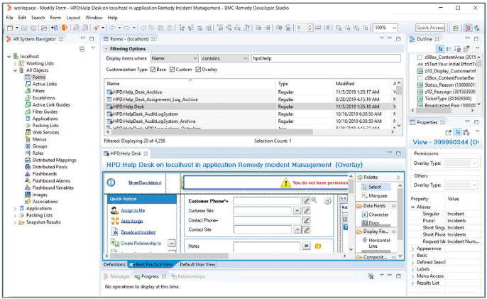
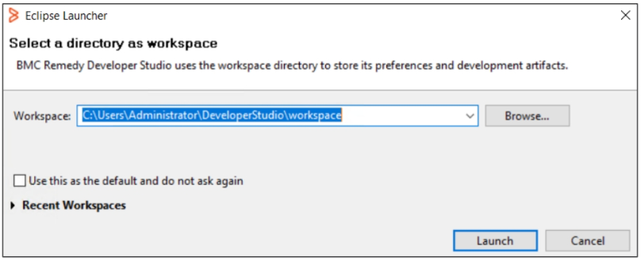
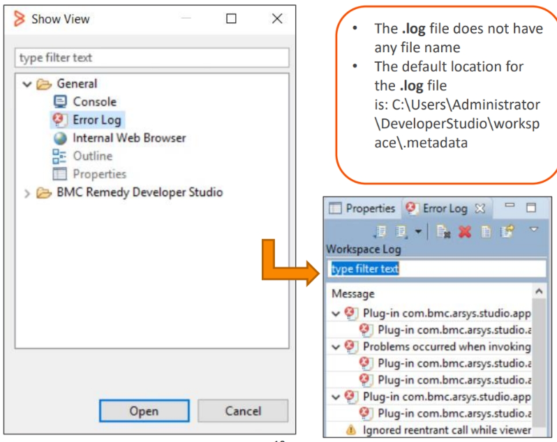
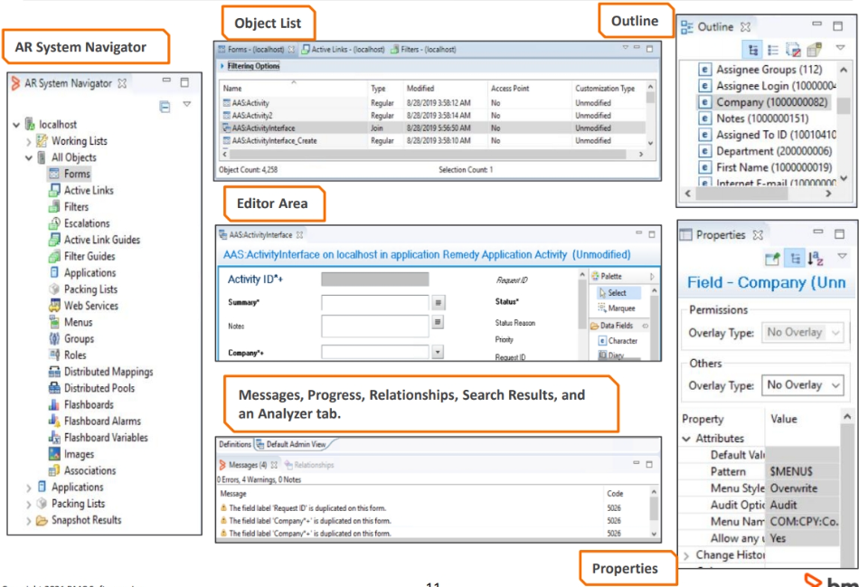




{: .border-bottom .border-3 .border-info .pb-2}
## Developer Studio Overview

  

Remedy Developer Studio is an integrated development environment (IDE) for Remedy AR
System applications. It provides all the application development functions needed to design an
application with a modern, powerful, easy-to-use interface.
Remedy Developer Studio uses the Java-based Eclipse platform to provide a framework for its
functions. Eclipse includes functions to organize the user interface (UI) and to work with UI
components that the Developer Studio provides.

You can log on to a Remedy AR System server from any computer on the network that has
access to the server. To use Remedy Developer Studio, you must be a Remedy AR System server
administrator or sub-administrator.

This tool can be installed on Microsoft Windows only.
  

  

{: style="width: 100%"}
  

{: .border-bottom .border-3 .border-info .pb-2}
## Authentication and Preferences

  

Remedy Developer Studio stores local preferences and other configuration information in the
workspace directory. Remedy Developer Studio stores local preferences and other configuration
information in the workspace directory.

You log in to Developer Studio with your AR User Name and password. To start Remedy
Developer Studio and log in to Remedy AR System servers:

1. Select **Start** > **Programs** > **BMC Software** > **AR System** > **BMC Remedy Developer Studio**.
2. To change the location of your workspace in the Workspace Launcher, click **Browse**, select
    or create a directory.
3. To clear all local preferences, configured Remedy AR System servers, and other local
    preferences and start Remedy Developer Studio in its initial state:
    - Exit Remedy Developer Studio.
    - Delete the workspace directory.
    - Restart Remedy Developer Studio.
4. In the Workspace Launcher dialog box, click **Launch** to open the login dialog box.

   

   The login dialog box displayed depends on whether Remedy Single Sign-On (SSO) is
   enabled for Remedy Developer Studio.
   

  

  

{: style="width: 100%"}

  

 
The default workspace location is

`C:\Documents and Settings|<userName>\DeveloperStudio\workspace`
  

  

  

**Logging on to a Remedy SSO-enabled server**

1. In the login dialog box, click **Edit Server List**.
2. Select one Remedy SSO-enabled server in the **Server List** dialog box and click **Next**.

    When you click **Login**, a new tab in the default browser is opened. If you are already logged
    in to the browser, the **User Name** and **Password** fields are not displayed in the browser
    tab. When you click **OK**, the message The authorization code was obtained. Please close this
    tab. is displayed in the browser. If you are not already logged in, enter your User
    **Name** and **Password**.

**Logging on to a non-Remedy SSO enabled server**

When you perform the following steps, the **User Name** and **Password** fields are available in the
login dialog box:

1. In the login dialog box, click **Edit Server List**.
2. Select only one non-Remedy SSO enabled server in the **Server List** dialog box and click **Next**.
3. In the **User Name** field, enter the name of a Remedy AR System server administrator or
    subadministrator.
4. Enter the password of the Remedy AR System user.
5. _(Optional)_ If you are required to specify an authentication string or a preference server,
    click **Options**.
    - Enter an authentication string. Whether you need an authentication string depends on
      how your server validates users. For most situations, this field is not used.
    - In the **Preference Server** field, type the name of your preference server. If the
      preference server does not use the default TCP port, type the port number in
      the **Preference Server TCP** field.
6. If you have already configured Remedy AR System server to connect to, click **Login**.

  

  

{: style="width: 100%"}
  

Click **Edit Server List** to add a new server and its alias.

{: .border-bottom .border-3 .border-info .pb-2}
## Enabling Remedy Single Sign-On (RSSO) for Remedy Developer Studio

  

To enable Remedy Single Sign-On (RSSO) for Developer Studio:

1. Log in to Developer Studio as an AR System Administrator.
2. Select **Window** > **Preferences**. The **Preferences** dialog box is displayed.
3. In the **Remedy Single Sign-On for User Authentication** section, select **Enabled**. By default,
   RSSO is disabled.
4. Click **Apply and Close**.
5. Enter the following settings in Centralized Configuration System (CCS) for the AR Server to
   be identified as an RSSO-integrated server:
   - Force-RSSO-Authentication
   - RSSO-External-URL
   - RSSO-Client-Secret

Refer to documentation for further details about CCS related settings.
  

  

{: style="width: 100%"}
  

  

If a developer successfully logs in to Remedy Developer Studio, no logs are updated. However, if
the developer fails to log in successfully, you can find the exception stack trace in the `.log` file at
the Remedy Developer Studio workspace.

Alternatively, you can find the logging information by performing the following steps:

1. In Developer Studio, select **Window** > **Show View** > **Other**.
2. The **Show View** dialog box is displayed.
3. Double-click the **General** folder to open it.
4. Click **Error Log**.
5. Click **Open**.
6. The **Error Log** pane is displayed on the right.
  

  

  
{: style="width: 100%"}
  

  

A representation of the Developer perspective is displayed on the screen. Developer Studio
allows you to view objects by double-clicking objects in the AR System Navigator. When you
double-click, an Object List will appear. If you double-click an object, the editor area will appear.
There are also tabs at the bottom that provide valuable information.

The **Outline** tab allows you to locate objects on a form. It displays a visual overview of the
object in an editor. When you select an item in the outline, it is also selected in the editor and
vice versa. You can sort the objects by **Name** or **Field ID**.

If you are editing a form, you can select a field and the **Properties** tab will display the properties
for that field. All objects have properties, you will explore the properties for each object in the
modules that follow.

Open the Editor perspective and switch to it when you need a large editor area. This perspective
has the **Properties** tab in the top right corner, the **Outline** in the bottom right corner, and
the **Messages** and **Relationships** tabs and the AR System Navigator in a tab group.
  

  

  
{: style="width: 100%"}
  

{: .border-bottom .border-3 .border-info .pb-2}
## Developer Studio Perspectives

  

**Developer perspective**

- Contains tabs and editors to find, create, and modify objects on BMC Remedy AR System servers

**Editor perspective**

- Contains only the tabs and editors you need when you are editing an object

**Custom perspective**

- To arrange the default layout, you can
  - Resize a tab group
  - Close or open a tab
  - Move a tab to another area or group
  - Minimize or maximize a tab group

**Save Perspective**

- Select Window > Save Perspective

**Reset perspective**

- Select Window > Reset Perspective.

---

BMC Remedy Developer Studio is an integrated development environment (IDE) for BMC
Remedy AR System applications. It provides all the application development functions with a
modern, powerful, easy-to-use interface.
It is an Eclipse application, which uses perspectives to organize windows into layouts. In BMC
Remedy Developer Studio, there are two perspectives:

- **Developer perspective:** Contains tabs and editors to find, create, and modify objects on BMC
  Remedy AR System servers.
- **Editor perspective:** Contains only the tabs and editors you need when you are editing an
  object.

To save a custom perspective: Select **Window** > **Save Perspective As**. In the Save Perspective As
dialog box, give the perspective a name and click **OK**.

To open a perspective: Select **Window** > **Open Perspective** > **Other**. In the Open Perspective
dialog box, select the appropriate perspective and click **OK**.

To switch to another open perspective: Click the icon or name of the perspective in the
Perspective bar in the top left corner of the BMC Remedy Developer Studio window.
  

