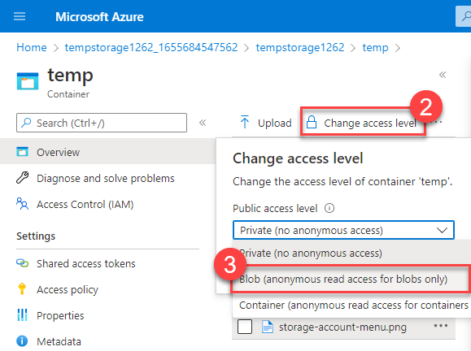

[_Back_]

## Create a storage account

In this task, you'll create a new storage account.

<!--   -->
1.  <span class="form-check"> Sign in to the Azure portal at [https://portal.azure.com](https://portal.azure.com/learn.docs.microsoft.com?azure-portal=true)</span>
    <!--  -->
2.  <span class="form-check"> Select **Create a resource**.</span>
    <!--  -->
3.  <span class="form-check"> Under Categories, select **Storage**.</span>
    <!--  -->
4.  <span class="form-check"> Under Storage account, select **Create**.</span>
    <!--  -->
5.  <span class="form-check"> On the **Basics** tab of the Create a storage account blade, fill in the following information. Leave the defaults for everything else.</span>
    
    | **Setting**          | **Value**                                                      |
    | -------------------- | -------------------------------------------------------------- |
    | Subscription         | Select the subscription you want to use for the exercise.      |
    | Resource group       | Select Create new and enter **`IntroAzureRG`** and select OK   |
    | Storage account name | Create a unique storage account name                           |
    | Region               | Leave default                                                  |
    | Performance          | Standard                                                       |
    | Redundancy           | Locally redundant storage (LRS)                                |
    {: .table table-sm .table-bordered .table-striped .table-hover .w-75}

    <!--  -->
6.  <span class="form-check"> On the **Advanced** tab of the Create a storage account blade, fill in the following information. Leave the defaults for everything else.</span>
    
    | **Setting**                                              | **Value** |
    | -------------------------------------------------------- | --------- |
    | Allow enabling anonymous access on individual containers | Checked   |
    {: .table table-sm .table-bordered .table-striped .table-hover .w-75}
    
    
    
    <!--  -->
7.  <span class="form-check"> Select **Review** to review your storage account settings and allow Azure to validate the configuration.</span>
    <!--  -->
8.  <span class="form-check"> Once validated, select **Create**. Wait for the notification that the account was successfully created.</span>
    <!--  -->
9.  <span class="form-check"> Select **Go to resource**.</span>

## Work with blob storage

In this section, you'll create a Blob container and upload a picture.

<!--  -->
1.  <span class="form-check"> Under **Data storage**, select **Containers**.</span>
    
    
    
    <!--  -->
2.  <span class="form-check"> Select **+ Container** and complete the information.</span>
    
    | **Setting**         | **Value**                      |
    | ------------------- | ------------------------------ |
    | Name                | Enter a name for the container |
    | Public access level | Private (no anonymous access)  |
    {: .table table-sm .table-bordered .table-striped .table-hover .w-75}

    <!--  -->
3.  <span class="form-check"> Select Create.</span>

    

    <!--  -->
4.  <span class="form-check"> Back in the Azure portal, select the container you created, then select Upload.</span>
    <!--  -->
5.  <span class="form-check"> Browse for the image file you want to upload. Select it and then select upload.</span>

    

    <!--  -->
6.  <span class="form-check"> Select the Blob (file) you just uploaded. You should be on the properties tab.</span>
    <!--  -->
7.  <span class="form-check"> Copy the URL from the URL field and paste it into a new tab.</span>
    
    You should receive an error message similar to the following.
    
    ```xml
    <Error>
      <Code>ResourceNotFound</Code>
      <Message>The specified resource does not exist. RequestId:4a4bd3d9-101e-005a-1a3e-84bd42000000</Message>
    </Error>
    
    ```

## Change the access level of your blob

<!--  -->
1.  <span class="form-check"> Go back to the Azure portal.</span>
    <!--  -->
2.  <span class="form-check"> Select Change access level.</span>
    <!--  -->
3.  <span class="form-check"> Set the Public access level to Blob (anonymous read access for blobs only).</span>
    
    
    
    <!--  -->
4.  <span class="form-check"> Select OK.</span>
    <!--  -->
5.  <span class="form-check"> Refresh the tab where you attempted to access the file earlier.</span>

Congratulations - you've completed this exercise. You created a storage account, added a container to the storage account, and then uploaded blobs (files) to your container. Then you changed the access level so you could access your file from the internet.

## Clean up

To clean up the assets created in this exercise and avoid unnecessary costs, delete the resource group _(and all associated resources)_.

<!--  -->
1. <span class="form-check"> From the Azure home page, under Azure services, select Resource groups.</span>
    <!--  -->
1. <span class="form-check"> Select the IntroAzureRG resource group.</span>
    <!--  -->
1. <span class="form-check"> Select Delete resource group.</span>
    <!--  -->
1. <span class="form-check"> Enter **`IntroAzureRG`** to confirm deletion of the resource group and select delete.</span>

[_Continue_]

[_Back_]: ../../describe-azure-architecture-and-services
[_Continue_]: ../../describe-azure-architecture-and-services
