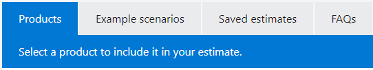

[_Back_]

In this exercise, you use the Pricing calculator to estimate the cost of running a basic web application on Azure.

Start by defining which Azure services you need.



## Define your requirements

Before you run the Pricing calculator, you need a sense of what Azure services you need.

For a basic web application hosted in your datacenter, you might run a configuration similar to the following.

An ASP.NET web application that runs on Windows. The web application provides information about product inventory and pricing. There are two virtual machines that are connected through a central load balancer. The web application connects to a SQL Server database that holds inventory and pricing information.

To migrate to Azure, you might:

 -  Use Azure Virtual Machines instances, similar to the virtual machines used in your datacenter.
 -  Use Azure Application Gateway for load balancing.
 -  Use Azure SQL Database to hold inventory and pricing information.

Here's a diagram that shows the basic configuration:

In practice, you would define your requirements in greater detail. But here are some basic facts and requirements to get you started:

 -  The application is used internally. It's not accessible to customers.
 -  This application doesn't require a massive amount of computing power.
 -  The virtual machines and the database run all the time (730 hours per month).
 -  The network processes about 1 TB of data per month.
 -  The database doesn't need to be configured for high-performance workloads and requires no more than 32 GB of storage.

## Explore the Pricing calculator

Let's start with a quick tour of the Pricing calculator.

<!--   -->
1.   Go to the [Pricing calculator](https://azure.microsoft.com/pricing/calculator/?azure-portal=true).
    <!--  -->
2.   Notice the following tabs:
    
    
    
     -  **Products** This is where you choose the Azure services that you want to include in your estimate. You'll likely spend most of your time here.
     -  **Example scenarios** Here you'll find several *reference architectures*, or common cloud-based solutions that you can use as a starting point.
     -  **Saved estimates** Here you'll find your previously saved estimates.
     -  **FAQs** Here you'll discover answers to frequently asked questions about the Pricing calculator.

## Estimate your solution

Here you add each Azure service that you need to the calculator. Then you configure each service to fit your needs.



### Add services to the estimate

<!--  -->
1.   On the **Products** tab, select the service from each of these categories:
    
    | **Category** | **Service**             |
    | ------------ | ----------------------- |
    | Compute      | **Virtual Machines**    |
    | Databases    | **Azure SQL Database**  |
    | Networking   | **Application Gateway** |
    {: .table table-sm .table-bordered .table-striped .table-hover .w-75}

    <!--  -->
2.   Scroll to the bottom of the page. Each service is listed with its default configuration.

### Configure services to match your requirements

<!--  -->
1.   Under **Virtual Machines**, set these values:
    
    | **Setting**      | **Value**             |
    | ---------------- | --------------------- |
    | Region           | **West US**           |
    | Operating system | **Windows**           |
    | Type             | **(OS Only)**         |
    | Tier             | **Standard**          |
    | Instance         | **D2 v3**             |
    | Virtual machines | **2** x **730 Hours** |
    {: .table table-sm .table-bordered .table-striped .table-hover .w-75}
    
    Leave the remaining settings at their current values.

    <!--  -->
2.   Under **Azure SQL Database**, set these values:
    
    | **Setting**         | **Value**           |
    | ------------------- | ------------------- |
    | Region              | **West US**         |
    | Type                | **Single Database** |
    | Backup storage tier | **RA-GRS**          |
    | Purchase model      | **vCore**           |
    | Service tier        | **General Purpose** |
    | Compute tier        | **Provisioned**     |
    | Generation          | **Gen 5**           |
    | Instance            | **8 vCore**         |
    {: .table table-sm .table-bordered .table-striped .table-hover .w-75}
    
    Leave the remaining settings at their current values.

    <!--  -->
3.   Under **Application Gateway**, set these values:
    
    | **Setting**            | **Value**                    |
    | ---------------------- | ---------------------------- |
    | Region                 | **West US**                  |
    | Tier                   | **Web Application Firewall** |
    | Size                   | **Medium**                   |
    | Gateway hours          | **2** x **730 Hours**        |
    | Data processed         | **1 TB**                     |
    | Outbound data transfer | **5 GB**                     |
    {: .table table-sm .table-bordered .table-striped .table-hover .w-75}
    
    Leave the remaining settings at their current values.

## Review, share, and save your estimate

At the bottom of the page, you see the total estimated cost of running the solution. You can change the currency type if you want.

At this point, you have a few options:

 -  Select **Export** to save your estimate as an Excel document.
 -  Select **Save** or **Save as** to save your estimate to the **Saved Estimates** tab for later.
 -  Select **Share** to generate a URL so you can share the estimate with your team.

You now have a cost estimate that you can share with your team. You can make adjustments as you discover any changes to your requirements.

Experiment with some of the options you worked with here, or create a purchase plan for a workload you want to run on Azure.

[_Continue_]

[_Back_]: ../../describe-azure-management-and-governance
[_Continue_]: ../../describe-azure-management-and-governance
