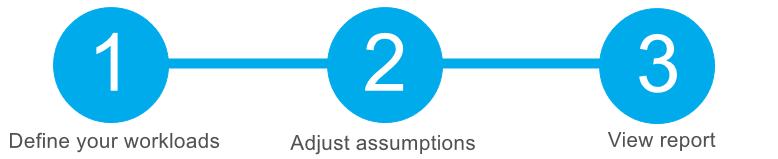

[_Back_]

In this exercise, you use the Total Cost of Ownership (TCO) Calculator to compare the cost of running a sample workload in your datacenter versus on Azure.

Assume you're considering moving some of your on-premises workloads to the cloud. But first, you need to understand more about moving from a relatively fixed cost structure to an ongoing monthly cost structure.

You'll need to investigate whether there are any potential cost savings in moving your datacenter to the cloud over the next three years. You need to take into account all of the potentially hidden costs involved with operating on-premises and in the cloud.

Instead of manually collecting everything you think might be included, you use the TCO Calculator as a starting point. You adjust the provided cost assumptions to match your on-premises environment.



Let's say that:

 -  You run two sets, or banks, of 50 virtual machines (VMs) in each bank.
 -  The first bank of VMs runs Windows Server under Hyper-V virtualization.
 -  The second bank of VMs runs Linux under VMware virtualization.
 -  There's also a storage area network (SAN) with 60 TB of disk storage.
 -  You consume an estimated 15 TB of outbound network bandwidth each month.
 -  There are also a number of databases involved, but for now, you'll omit those details.

Recall that the TCO Calculator involves three steps:

## Define your workloads

Enter the specifications of your on-premises infrastructure into the TCO Calculator.

<!--   -->
1.   Go to the [TCO Calculator](https://azure.microsoft.com/pricing/tco/calculator?azure-portal=true).
    <!--  -->
2.   Under **Define your workloads**, select **Add server workload** to create a row for your bank of Windows Server VMs.
    <!--  -->
3.   Under **Servers**, set the value for each of these settings:
    
    | **Setting**                 | **Value**                |
    | --------------------------- | ------------------------ |
    | Name                        | **Servers: Windows VMs** |
    | Workload                    | **Windows/Linux Server** |
    | Environment                 | **Virtual Machines**     |
    | Operating system            | **Windows**              |
    | Operating System License    | **Datacenter**           |
    | VMs                         | **50**                   |
    | Virtualization              | **Hyper-V**              |
    | Core(s)                     | **8**                    |
    | RAM (GB)                    | **16**                   |
    | Optimize by                 | **CPU**                  |
    | Windows Server 2008/2008 R2 | **Off**                  |
    {: .table table-sm .table-bordered .table-striped .table-hover .w-75}

    <!--  -->
4.   Select **Add server workload** to create a second row for your bank of Linux VMs. Then specify these settings:
    
    | **Setting**      | **Value**                |
    | ---------------- | ------------------------ |
    | Name             | **Servers: Linux VMs**   |
    | Workload         | **Windows/Linux Server** |
    | Environment      | **Virtual Machines**     |
    | Operating system | **Linux**                |
    | VMs              | **50**                   |
    | Virtualization   | **VMware**               |
    | Core(s)          | **8**                    |
    | RAM (GB)         | **16**                   |
    | Optimize by      | **CPU**                  |
    {: .table table-sm .table-bordered .table-striped .table-hover .w-75}

    <!--  -->
5.   Under **Storage**, select **Add storage**. Then specify these settings:
    
    | **Setting**  | **Value**          |
    | ------------ | ------------------ |
    | Name         | **Server Storage** |
    | Storage type | **Local Disk/SAN** |
    | Disk type    | **HDD**            |
    | Capacity     | **60 TB**          |
    | Backup       | **120 TB**         |
    | Archive      | **0 TB**           |
    {: .table table-sm .table-bordered .table-striped .table-hover .w-75}

    <!--  -->
6.   Under **Networking**, set **Outbound bandwidth** to **15 TB**.
    <!--  -->
7.   Select **Next**.

## Adjust assumptions

Here, you specify your currency. For brevity, you leave the remaining fields at their default values.

In practice, you would adjust any cost assumptions and make any adjustments to match your current on-premises environment.

<!--  -->
1.   At the top of the page, select your currency. This example uses **US Dollar ($)**.
    <!--  -->
2.   Select **Next**.

## View the report

Take a moment to review the generated report.

Remember, you've been tasked to investigate cost savings for your European datacenter over the next three years.

To make these adjustments:

<!--  -->
1.   Set **Timeframe** to **3 Years**.
    <!--  -->
2.   Set **Region** to **North Europe**.

Scroll to the summary at the bottom. You see a comparison of running your workloads in the datacenter versus on Azure.

Select **Download** to download or print a copy of the report in PDF format.

Great work. You now have the information that you can share with your Chief Financial Officer. If you need to make adjustments, you can revisit the TCO Calculator to generate a fresh report.

[_Continue_]

[_Back_]: ../../describe-azure-management-and-governance
[_Continue_]: ../../describe-azure-management-and-governance
