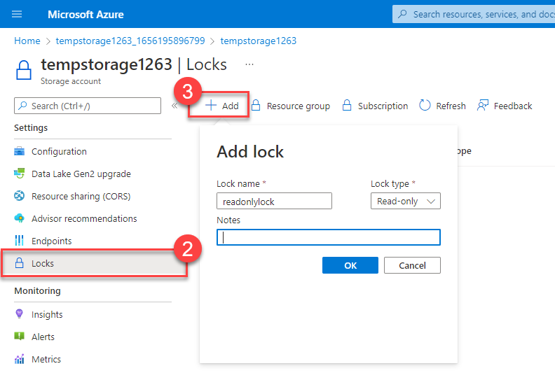
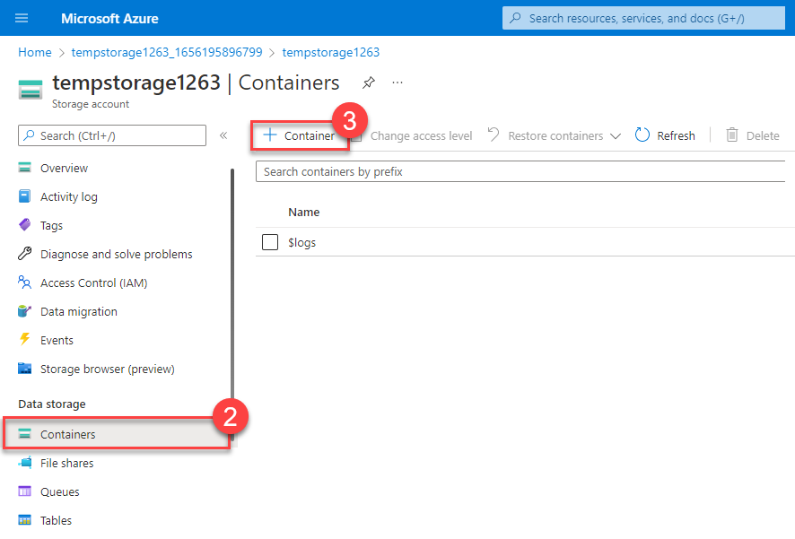
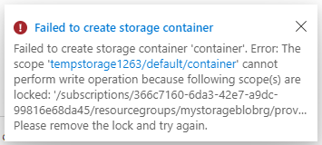
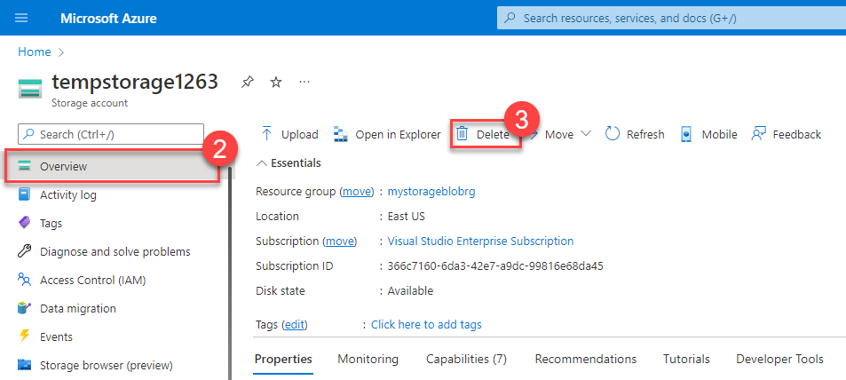
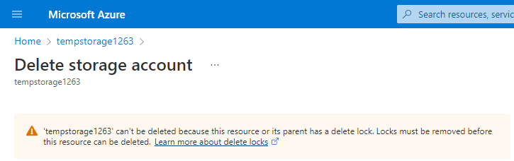
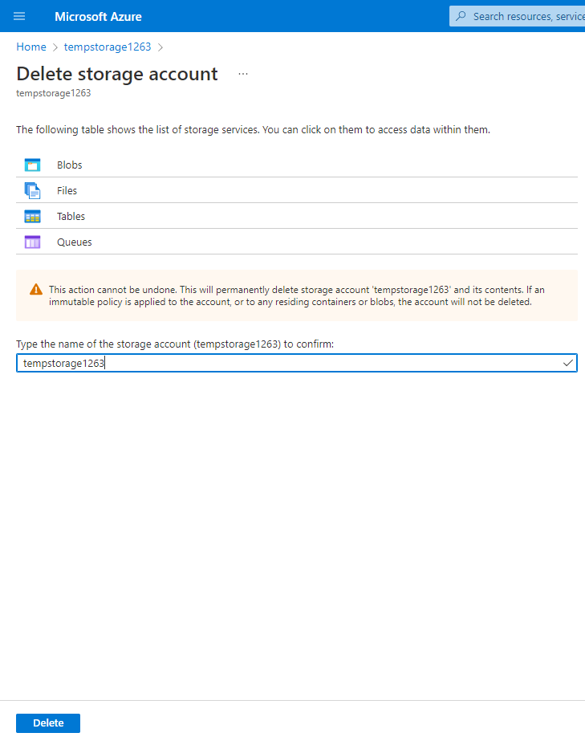

[_Back_]

In this exercise, you’ll create a resource and configure a resource lock. Storage accounts are one of the easiest types of resource locks to quickly see the impact, so you’ll use a storage account for this exercise.

This exercise is a Bring your own subscription exercise, meaning you’ll need to provide your own Azure subscription to complete the exercise. Don’t worry though, the entire exercise can be completed for free with the 12 month free services when you sign up for an Azure account.

For help with signing up for an Azure account, see the [Create an Azure account](https://docs.microsoft.com/learn/modules/create-an-azure-account/) learning module.

Once you’ve created your free account, follow the steps below. If you don’t have an Azure account, you can review the steps to see the process for adding a simple resource lock to a resource.

## Task 1: Create a resource

In order to apply a resource lock, you have to have a resource created in Azure. The first task focuses on creating a resource that you can then lock in subsequent tasks.

<!--   -->
1.   Sign in to the [**Azure portal**](https://portal.azure.com)
    <!--  -->
2.   Select **Create a resource**.
    <!--  -->
3.   Under Categories, select **`Storage`**.
    <!--  -->
4.   Under Storage Account, select **Create**.
    <!--  -->
5.   On the Basics tab of the Create storage account blade, fill in the following information. Leave the defaults for everything else.
    
    | **Setting**          | **Value**                           |
    | -------------------- | ----------------------------------- |
    | Resource group       | Create new                          |
    | Storage account name | enter a unique storage account name |
    | Location             | default                             |
    | Performance          | Standard                            |
    | Redundancy           | Locally redundant storage (LRS)     |
    {: .table table-sm .table-bordered .table-striped .table-hover .w-75}

    <!--  -->
6.   Select Review + Create to review your storage account settings and allow Azure to validate the configuration.
    <!--  -->
7.   Once validated, select Create. Wait for the notification that the account was successfully created.
    <!--  -->
8.   Select Go to resource.

## Task 2: Apply a read-only resource lock

In this task you apply a read-only resource lock to the storage account. What impact do you think that will have on the storage account?

<!--  -->
1.   Scroll down until you find the Settings section of the blade on the left of the screen.
    <!--  -->
2.   Select Locks.
    <!--  -->
3.   Select + Add.
    
    

    <!--  -->
4.   Enter a Lock name.
    <!--  -->
5.   Verify the Lock type is set to Read-only.
    <!--  -->
6.   Select OK.

## Task 3: Add a container to the storage account

In this task, you add a container to the storage account, this container is where you can store your blobs.

<!--  -->
1.   Scroll up until you find the Data storage section of the blade on the left of the screen.
    <!--  -->
2.   Select Containers.
    <!--  -->
3.   Select + Container.
    
    

    <!--  -->
4.   Enter a container name and select Create.
    <!--  -->
5.   You should receive an error message: Failed to create storage container.
    
    



## Task 4: Modify the resource lock and create a storage container

<!--  -->
1.   Scroll down until you find the Settings section of the blade on the left of the screen.
    <!--  -->
2.   Select Locks.
    <!--  -->
3.   Select the read-only resource lock you created.
    <!--  -->
4.   Change the Lock type to Delete and select OK.
    
    

    <!--  -->
5.   Scroll up until you find the Data storage section of the blade on the left of the screen.
    <!--  -->
6.   Select Containers.
    <!--  -->
7.   Select + Container.
    <!--  -->
8.   Enter a container name and select Create.
    <!--  -->
9.   Your storage container should appear in your list of containers.

You can now understand how the read-only lock prevented you from adding a container to your storage account. Once the lock type was changed (you could have removed it instead), you were able to add a container.

## Task 5: Delete the storage account

You'll actually do this last task twice. Remember that there is a delete lock on the storage account, so you won't actually be able to delete the storage account yet.

<!--  -->
1.   Scroll up until you find Overview at the top of the blade on the left of the screen.
    <!--  -->
2.   Select Overview.
    <!--  -->
3.   Select Delete.
    
    

You should get a notification letting you know you can't delete the resource because it has a delete lock. In order to delete the storage account, you'll need to remove the delete lock.

## Task 6: Remove the delete lock and delete the storage account

In the final task, you remove the resource lock and delete the storage account from your Azure account. This step is important. You want to make sure you don't have any idle resource just sitting in your account.

<!--  -->
1.   Select your storage account name in the breadcrumb at the top of the screen.
    <!--  -->
2.   Scroll down until you find the Settings section of the blade on the left of the screen.
    <!--  -->
3.   Select Locks.
    <!--  -->
4.   Select Delete.
    <!--  -->
5.   Select Home in the breadcrumb at the top of the screen.
    <!--  -->
6.   Select Storage accounts
    <!--  -->
7.   Select the storage account you used for this exercise.
    <!--  -->
8.   Select Delete.
    <!--  -->
9.   To prevent accidental deletion, Azure prompts you to enter the name of the storage account you want to delete. Enter the name of the storage account and select Delete.
    
    

    <!--  -->
10.  You should receive a message that the storage account was deleted. If you go Home &gt; Storage accounts, you should see that the storage account you created for this exercise is gone.

Congratulations! You've completed configuring, updating, and removing a resource lock on an Azure resource.



[_Continue_]

[_Back_]: ../../describe-azure-management-and-governance
[_Continue_]: ../../describe-azure-management-and-governance
