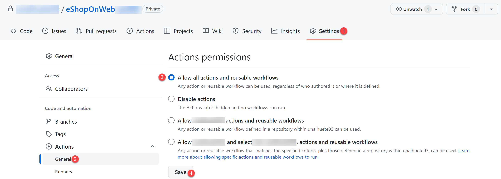

## Lab requirements

- This lab requires **Microsoft Edge** or an
  [Azure DevOps supported browser.](https://docs.microsoft.com/en-us/azure/devops/server/compatibility?view=azure-devops#web-portal-supported-browsers){:target="_blank"}

- Identify an existing Azure subscription or create a new one.

- Verify that you have a Microsoft account or an Azure AD account with the Contributor or the Owner role in the Azure subscription.
  For details, refer to [List Azure role assignments using the Azure portal](https://docs.microsoft.com/azure/role-based-access-control/role-assignments-list-portal){:target="_blank"} and
  [View and assign administrator roles in Azure Active Directory](https://docs.microsoft.com/azure/active-directory/roles/manage-roles-portal#view-my-roles){:target="_blank"}.

- **If you don't already have a GitHub account** that you can use for this lab, follow instructions available at
  [Signing up for a new GitHub account](https://github.com/join){:target="_blank"} to create one.

## Lab overview

In this lab, you'll learn how to implement a GitHub Action workflow that deploys an Azure web app.

## Objectives

After you complete this lab, you will be able to:

- Implement a GitHub Action workflow for CI/CD.
- Explain the basic characteristics of GitHub Action workflows.

## Estimated timing: 40 minutes

## Instructions

### Exercise 0: Import eShopOnWeb to your GitHub Repository

In this exercise, you will import the existing [eShopOnWeb](https://github.com/MicrosoftLearning/eShopOnWeb){:target="_blank"} repository code to your own GitHub private repo.

The repository is organized the following way:
    - **.ado** folder contains Azure DevOps YAML pipelines
    - **.devcontainer** folder container setup to develop using containers (either locally in VS Code or GitHub Codespaces)
    - **.azure** folder contains Bicep & ARM infrastructure as code templates used in some lab scenarios.
    - **.github** folder container YAML GitHub workflow definitions.
    - **src** folder contains the .NET 6 website used on the lab scenarios.

#### Task 1: Create a public repository in GitHub and import eShopOnWeb

In this task, you will create an empty public GitHub repository and import the existing [eShopOnWeb](https://github.com/MicrosoftLearning/eShopOnWeb){:target="_blank"} repository.

1. <input type="checkbox" class="box" id="{{ page.chkbx-pre-ids }}-exer0-01" name="{{ page.chkbx-pre-ids }}-exer0-01" /> From the lab computer,
   start a web browser, navigate to the [GitHub website](https://github.com/){:target="_blank"}, sign in using your account and click on **New** to create new repository.

    

2. <input type="checkbox" class="box" id="{{ page.chkbx-pre-ids }}-exer0-02" name="{{ page.chkbx-pre-ids }}-exer0-02" /> On the **Create a new repository** page, click on **Import a repository** link (below the page title).

    > NOTE: you can also open the import website directly at https://github.com/new/import

3. <input type="checkbox" class="box" id="{{ page.chkbx-pre-ids }}-exer0-03" name="{{ page.chkbx-pre-ids }}-exer0-03" /> On the **Import your project to GitHub** page:

    | Field | Value |
    | --- | --- |
    | Your old repository’s clone URL| https://github.com/MicrosoftLearning/eShopOnWeb |
    | Owner | Your account alias |
    | Repository Name | eShopOnWeb |
    | Privacy | **Public** | 

4. <input type="checkbox" class="box" id="{{ page.chkbx-pre-ids }}-exer0-04" name="{{ page.chkbx-pre-ids }}-exer0-04" /> Click on **Begin Import** and wait for your repository to be ready.

5. <input type="checkbox" class="box" id="{{ page.chkbx-pre-ids }}-exer0-05" name="{{ page.chkbx-pre-ids }}-exer0-05" /> On the repository page, go to **Settings**, click on **Actions > General** and choose the option **Allow all actions and reusable workflows**. Click on **Save**.

    

### Exercise 1: Setup your GitHub Repository and Azure access

In this exercise, you will create an Azure Service Principal to authorize GitHub accessing your Azure subscription from GitHub Actions. You will also setup the GitHub workflow that will build, test and deploy your website to Azure. 

#### Task 1: Create an Azure Service Principal and save it as GitHub secret

In this task, you will create the Azure Service Principal used by GitHub to deploy the desired resources. As an alternative, you could also use [OpenID connect in Azure](https://docs.github.com/actions/deployment/security-hardening-your-deployments/configuring-openid-connect-in-azure), as a secretless authentication mechanism.

1. <input type="checkbox" class="box" id="{{ page.chkbx-pre-ids }}-exer1-task1-01" name="{{ page.chkbx-pre-ids }}-exer1-task1-01" /> On your lab computer, in a browser window, open the Azure Portal (https://portal.azure.com/).
2. <input type="checkbox" class="box" id="{{ page.chkbx-pre-ids }}-exer1-task1-02" name="{{ page.chkbx-pre-ids }}-exer1-task1-02" /> In the portal, look for **Resource Groups** and click on it.
3. <input type="checkbox" class="box" id="{{ page.chkbx-pre-ids }}-exer1-task1-03" name="{{ page.chkbx-pre-ids }}-exer1-task1-03" /> Click on **+ Create** to create a new Resource Group for the exercise.
4. <input type="checkbox" class="box" id="{{ page.chkbx-pre-ids }}-exer1-task1-04" name="{{ page.chkbx-pre-ids }}-exer1-task1-04" /> On the **Create a resource group** tab, give the following name to your Resource Group: **rg-az400-eshopeonweb-NAME** (replace NAME for some unique alias). Click on **Review+Create > Create**.
5. <input type="checkbox" class="box" id="{{ page.chkbx-pre-ids }}-exer1-task1-05" name="{{ page.chkbx-pre-ids }}-exer1-task1-05" /> In the Azure Portal, open the **Cloud Shell** (next to the search bar).

    > NOTE: if this is the first time you open the Cloud Shell, you need to configure the
    > [persistent storage](https://learn.microsoft.com/en-us/azure/cloud-shell/persisting-shell-storage#create-new-storage){:target="_blank"}

6. <input type="checkbox" class="box" id="{{ page.chkbx-pre-ids }}-exer1-task1-06" name="{{ page.chkbx-pre-ids }}-exer1-task1-06" /> Make sure the terminal is running in **Bash** mode and execute the following command, replacing **SUBSCRIPTION-ID** and **RESOURCE-GROUP** with your own identifiers (both can be found on the **Overview** page of the Resorce Group):

    `az ad sp create-for-rbac --name GH-Action-eshoponweb --role contributor --scopes /subscriptions/SUBSCRIPTION-ID/resourceGroups/RESOURCE-GROUP --sdk-auth`

    > NOTE: this command will create a Service Principal with Contributor access to the Resource Group created before. This way we make sure GitHub Actions will only have the permissions needed to interact only with this Resource Group (not the rest of the subscription)

7. <input type="checkbox" class="box" id="{{ page.chkbx-pre-ids }}-exer1-task1-07" name="{{ page.chkbx-pre-ids }}-exer1-task1-07" /> The command will output a JSON object,
   you will later keep it as a GitHub secret for the workflow, copy it.
   The JSON contains the identifiers used to authenticate against Azure in the
   name of an Azure AD application identity (service principal).

   <i title="Copy Text" style="float:right;" class="fas fa-clipboard" onclick="posttoclip('exer1-task1-07-code')"></i>
   

<pre class="highlight">
   <code id="exer1-task1-07-code">{
     "clientId": "&lt;GUID&gt;",
     "clientSecret": "&lt;GUID&gt;",
     "subscriptionId": "&lt;GUID&gt;",
     "tenantId": "&lt;GUID&gt;",
     (...)
   }</code></pre>

8. <input type="checkbox" class="box" id="{{ page.chkbx-pre-ids }}-exer1-task1-08" name="{{ page.chkbx-pre-ids }}-exer1-task1-08" /> In a browser window, go back to your **eShopOnWeb** GitHub repository.
9. <input type="checkbox" class="box" id="{{ page.chkbx-pre-ids }}-exer1-task1-09" name="{{ page.chkbx-pre-ids }}-exer1-task1-09" /> On the repository page, go to **Settings**, click on **Secrets > Actions**. Click on **New repository secret**

    - Name : **AZURE_CREDENTIALS**
    - Secret: **paste the previously copied  JSON object** (GitHub is able to keep multiple secrets under same name, used by  [azure/login](https://github.com/Azure/login) action )

10. <input type="checkbox" class="box" id="{{ page.chkbx-pre-ids }}-exer1-task1-10" name="{{ page.chkbx-pre-ids }}-exer1-task1-10" /> Click on **Add secret**. Now GitHub Actions will be able to reference the service principal, using the repository secret.

#### Task 2: Modify and execute the GitHub workflow

In this task, you will modify the given GitHub workflow and execute it to deploy the solution in your own subscription.

1. <input type="checkbox" class="box" id="{{ page.chkbx-pre-ids }}-exer1-task2-01" name="{{ page.chkbx-pre-ids }}-exer1-task2-01" /> In a browser window, go back to your **eShopOnWeb** GitHub repository.
2. <input type="checkbox" class="box" id="{{ page.chkbx-pre-ids }}-exer1-task2-02" name="{{ page.chkbx-pre-ids }}-exer1-task2-02" /> On the repository page, go to **Code** and open the following file: **eShopOnWeb/.github/workflows/eshoponweb-cicd.yml**. This workflow defines the CI/CD process for the given .NET 6 website code.
3. <input type="checkbox" class="box" id="{{ page.chkbx-pre-ids }}-exer1-task2-03" name="{{ page.chkbx-pre-ids }}-exer1-task2-03" /> Uncomment the **on** section (delete "#"). The workflow triggers with every push to the main branch and also offers manual triggering ("workflow_dispatch").
4. <input type="checkbox" class="box" id="{{ page.chkbx-pre-ids }}-exer1-task2-04" name="{{ page.chkbx-pre-ids }}-exer1-task2-04" /> In the **env** section, make the following changes:

    - Replace **NAME** in **RESOURCE-GROUP** variable. It should be the same resource group created in previous steps.
    - (Optional) You can choose your closest [azure region](https://azure.microsoft.com/en-gb/explore/global-infrastructure/geographies/#geographies) for **LOCATION**. For example, "eastus", "eastasia", "westus", etc.
    - Replace **YOUR-SUBS-ID** in **SUBSCRIPTION-ID**.
    - Replace **NAME** in **WEBAPP-NAME** with some unique alias. It will be used to create a globally unique website using Azure App Service.

5. <input type="checkbox" class="box" id="{{ page.chkbx-pre-ids }}-exer1-task2-05" name="{{ page.chkbx-pre-ids }}-exer1-task2-05" /> Read the workflow carefully, comments are provided to help understand.
6. <input type="checkbox" class="box" id="{{ page.chkbx-pre-ids }}-exer1-task2-06" name="{{ page.chkbx-pre-ids }}-exer1-task2-06" /> Click on **Start Commit** and **Commit Changes** leaving defaults (changing the main branch). The workflow will get automatically executed.

#### Task 3: Review GitHub Workflow execution

In this task, you will review the GitHub workflow execution:

1. <input type="checkbox" class="box" id="{{ page.chkbx-pre-ids }}-exer1-task3-01" name="{{ page.chkbx-pre-ids }}-exer1-task3-01" /> In a browser window, go back to your **eShopOnWeb** GitHub repository.
2. <input type="checkbox" class="box" id="{{ page.chkbx-pre-ids }}-exer1-task3-02" name="{{ page.chkbx-pre-ids }}-exer1-task3-02" /> On the repository page, go to **Actions**, you will see the workflow setup before executing. Click on it.

    

3. <input type="checkbox" class="box" id="{{ page.chkbx-pre-ids }}-exer1-task3-03" name="{{ page.chkbx-pre-ids }}-exer1-task3-03" /> Wait for the workflow to finish. From the **Summary** you can see the two workflow jobs, the status and Artifacts retained from the execution. You can click in each job to review logs.

    

4. <input type="checkbox" class="box" id="{{ page.chkbx-pre-ids }}-exer1-task3-04" name="{{ page.chkbx-pre-ids }}-exer1-task3-04" /> In a browser window, go back to the
   [**Azure Portal**](https://portal.azure.com/){:target="_blank"}. Open the resource group created before. You will see that the GitHub Action, using a bicep template,
   has created an Azure App Service Plan + App Service. You can see the published website opening the App Service and clicking **Browse**.

    

#### (OPTIONAL) Task 4: Add manual approval pre-deploy using GitHub Environments

In this task, you will use GitHub environments to ask for manual approval before executing the actions defined on the deploy job of your workflow.

1. <input type="checkbox" class="box" id="{{ page.chkbx-pre-ids }}-exer1-task4-01" name="{{ page.chkbx-pre-ids }}-exer1-task4-01" /> On the repository page, go to **Code** and open the following file: **eShopOnWeb/.github/workflows/eshoponweb-cicd.yml**.
2. <input type="checkbox" class="box" id="{{ page.chkbx-pre-ids }}-exer1-task4-02" name="{{ page.chkbx-pre-ids }}-exer1-task4-02" /> In the **deploy** job section, you can find a reference to an **enviroment** called **Development**. GitHub used [environments](https://docs.github.com/en/actions/deployment/targeting-different-environments/using-environments-for-deployment) add protection rules (and secrets) for your targets.
3. <input type="checkbox" class="box" id="{{ page.chkbx-pre-ids }}-exer1-task4-03" name="{{ page.chkbx-pre-ids }}-exer1-task4-03" /> On the repository page, go to **Settings**, open **Environments** and click **New environment**.
4. <input type="checkbox" class="box" id="{{ page.chkbx-pre-ids }}-exer1-task4-04" name="{{ page.chkbx-pre-ids }}-exer1-task4-04" /> Give it **Development** name and click on **Configure Environment**.
5. <input type="checkbox" class="box" id="{{ page.chkbx-pre-ids }}-exer1-task4-05" name="{{ page.chkbx-pre-ids }}-exer1-task4-05" /> In the **Configure Development** tab, check the option **Required Reviewers** and your GitHub account as a reviewer. Click on **Save protection rules**.
6. <input type="checkbox" class="box" id="{{ page.chkbx-pre-ids }}-exer1-task4-06" name="{{ page.chkbx-pre-ids }}-exer1-task4-06" /> Now lets test the protection rule. On the repository page, go to **Actions**, click on **eShopOnWeb Build and Test** workflow and click on **Run workflow>Run workflow** to execute manually.

    

7. <input type="checkbox" class="box" id="{{ page.chkbx-pre-ids }}-exer1-task4-07" name="{{ page.chkbx-pre-ids }}-exer1-task4-07" /> Click on the started execution of the workflow and wait for **buildandtest** job to finish. You will see a review request when **deploy** job is reached.
8. <input type="checkbox" class="box" id="{{ page.chkbx-pre-ids }}-exer1-task4-08" name="{{ page.chkbx-pre-ids }}-exer1-task4-08" /> Click on **Review deployments**, check **Development** and click on **Approve and deploy**.

    

9. <input type="checkbox" class="box" id="{{ page.chkbx-pre-ids }}-exer1-task4-09" name="{{ page.chkbx-pre-ids }}-exer1-task4-09" /> Workflow will follow the **deploy** job execution and finish.

### Exercise 2: Remove the Azure lab resources

In this exercise, you will use Azure Cloud Shell to remove the Azure resources provisioned in this lab to eliminate unnecessary charges.

1. <input type="checkbox" class="box" id="{{ page.chkbx-pre-ids }}-exer2-01" name="{{ page.chkbx-pre-ids }}-exer2-01" /> In the Azure portal, open the **Bash** shell session within the **Cloud Shell** pane.
2. <input type="checkbox" class="box" id="{{ page.chkbx-pre-ids }}-exer2-02" name="{{ page.chkbx-pre-ids }}-exer2-02" /> List all resource groups created throughout the labs of this module by running the following command:

   <i style="float:right;" title="Copy Text" class="fas fa-clipboard" onclick="posttoclip('exer2-02')"></i>
   

<pre class="highlight">
   <code id="exer2-02">az group list --query "[?starts_with(name,'rg-az400-eshopeonweb')].name" --output tsv</code></pre>
   

3. <input type="checkbox" class="box" id="{{ page.chkbx-pre-ids }}-exer2-03" name="{{ page.chkbx-pre-ids }}-exer2-03" /> Delete all resource groups you created throughout the labs of this module by running the following command:

   <i style="float:right;" title="Copy Text" class="fas fa-clipboard" onclick="posttoclip('exer2-03-code')"></i>
   

<pre class="highlight">
   <code id="exer2-03-code">az group list --query "[?starts_with(name,'rg-az400-eshopeonweb')].[name]" --output tsv | xargs -L1 bash -c 'az group delete --name $0 --no-wait --yes'</code></pre>
    

    >**Note**: The command executes asynchronously (as determined by the --nowait parameter), so while you will be able to run another Azure CLI command immediately afterwards within the same Bash session, it will take a few minutes before the resource groups are actually removed.

## Review

In this lab, you implemented a GitHub Action workflow that deploys an Azure Web App.
