## Description

The following method will assist in getting tools ready for editing documents,
in just about any format, and make trackable changes within those document(s).
In this page I make use of Markdown since it's become a standard for many
technical writers today. I will also use a source management system to check
in my edited files. For this page I use **Microsoft's Azure DevOps** for
as a repository storage, you may use other services such as GitHub, GitLab,
Bitbucket, or other but the tools below are still recommended.

1. [![GIT Logo]{:height="15"}][GIT]{:target="_blank"}
   <span style="color: grey;">version control
   _(BTW, full name is **Global information Tracker**)_</span>
2. [Pandoc]{:target="_blank"}
   <span style="color: grey;">a universal document converter</span>
3. [![VS Code Logo]{:height="15"}Visual Studio Code][VS Code]{:target="_blank"}
   <span style="color: grey;">_(a.k.a. **VS Code**)_ for editing the documents</span>

<small>📓
_Within this document I created icons (<i class="fas fa-clipboard"></i>) on_
_the right side of text areas that will allow you to place the text into your_
_workstation's clipboard. Please feel free to use them._</small>

## Tools

### Get the Tools

Download and install each of these 3 tools onto your workstation.

1. <input type="checkbox" />[![GIT Logo]{:height="15"}][GIT Downloads]{:class="ui-button ui-widget ui-corner-all"}
2. <input type="checkbox" />[![VS Code Logo]{:height="15"} Visual Studio Code][VS Code]{:class="ui-button ui-widget ui-corner-all"}
3. <input type="checkbox" />[Pandoc][Install Pandoc]{:class="ui-button ui-widget ui-corner-all"}

### Configure the Tools

After you've completed the installation of the 3 applications above, please
proceed to configure and/or confirm each app for the rest of
the tutorial.

1. **<u>GIT</u>**

   The GIT client on your workstation requires global parameters to be set.
   These parameters are used for tracking work you've contributed when posting
   changes to a repository _(a.k.a. **repo**)_. Without these parameters set,
   you will experience errors when publishing the changes.

   1. Verify that you have installed **GIT** on your workstation by completing
      the following steps:  
      1. <input type="checkbox" />Press and hold both the
         **`Windows Key(🪟)`** along with **`R`** on your keyboard.

         <small>📓
         _This will open a **`Run`** dialog box requesting you to_
         _type a command into a text box._</small>

      2. <input type="checkbox" />Type
         **`cmd`**<i title="Copy Text" class="fas fa-clipboard" clip-text='cmd'></i>
         in the text box and press the **Enter** key.

         <small>📓
         _This will open a new command window with a prompt._</small>

      3. <input type="checkbox" />Type
         **`git --version`**<i title="Copy Text" class="fas fa-clipboard" clip-text='git --version'></i>
         at the prompt and press the **Enter** key.

         <small>📓
         _You should get a response showing the GIT version installed_
         _on your workstation. If you did not get a version, or you received an_
         _error message, please install/re-install the GIT application and_
         _complete the above steps._</small>

      4. **<mark>Keep the command window open for the next task.</mark>**

   2. **Copy** and **paste** the commands shown below and execute them within
      a command window _(from previous task)_:

      1. <input type="checkbox" />Set **Username**

         <i title="Copy Text" style="float:right;" class="fas fa-clipboard" clip-text='git config --global user.name "[Your Name]"'></i>

         ```powershell
         git config --global user.name "[Your Name]"
         ```

         <small>❗_Replace **`[Your Name]`** and press the **Enter** key_</small>

      2. <input type="checkbox" />Set **User Email Address**

         <i title="Copy Text" style="float:right;" class="fas fa-clipboard" clip-text='git config --global user.email "[Your Email]"'></i>

         ```powershell
         git config --global user.email "[Your Email]"
         ```

         <small>❗_Replace **`[Your Email]`** and press the **Enter** key_</small>

2. **<u>VS Code</u>**

   VS Code does contain basic **Markdown** editing capabilities without the
   following extension pack, but these additional features will assist in many
   advanced markdown editing such as support of formulas, images, checkboxes,
   tables, emojis, and more.

   1. <input type="checkbox" />Open a browser window by clicking on the
      following button.

      [![Markdown Extensions Pack Logo]{:height="15"} Markdown Extensions Pack][Markdown Extensions Pack]{:class="ui-button ui-widget ui-corner-all"}

   2. <input type="checkbox" />On the new web browser page, click the
      **`Install`** button.

      <small>📓
      _VS Code should open up with the same web page displayed in a_
      _tab of the main window._</small>

   3. <input type="checkbox" />Click the
      **`Install`** button again on the page that is now displayed in VS Code.

      <small>📓
      _This should now show that it's installing the additional_
      _Markdown editing features. In a couple of minutes you can open the_
      _Extension Viewer to see the new features. Within the extensions view you_
      _may click each feature and read more details about each which may also_
      _provide how best to use each._</small>

   4. <input type="checkbox" />Install the following VS Code features by
      clicking the buttons below and follow the methods as in the previous steps.

      - [![GitHub Markdown Preview Logo]{:height="15"} GitHub Markdown Preview][GitHub Markdown Preview]{:class="ui-button ui-widget ui-corner-all"}
      - [![LTeX–Grammar & Spell Checking Logo]{:height="15"} LTeX–Grammar & Spell Checking][LTeX–Grammar & Spell Checking]{:class="ui-button ui-widget ui-corner-all"}
      - [![Azure Tools Logo]{:height="15"} Azure Tools][Azure Tools]{:class="ui-button ui-widget ui-corner-all"}
      - [![Prettier Logo]{:height="15"} Prettier][Prettier]{:class="ui-button ui-widget ui-corner-all"}

3. **<u>Pandoc</u>**

   There really aren't any configuration settings for Pandoc. Just verify that
   the tool has been installed by executing the following steps. _If you've_
   _kept the command window up from the **<u>GIT</u>** configuration, then you_
   _can use the same command window and skip to step #3 below._

   1. <input type="checkbox" />Press and hold both the
      **`Windows Key(🪟)`** along with **`R`** on your keyboard.

      <small>📓
      _This will open a **`Run`** dialog box requesting you to type a_
      _command into a text box._</small>

   2. <input type="checkbox" />Type
      **`cmd`**<i title='Copy Text' class='fas fa-clipboard' clip-text='cmd'></i>
      in the text box and press the `Enter` key.

      <small>📓
      _This will open a new command window with a prompt._</small>

   3. <input type="checkbox" />Type
      **`pandoc --version`**<i title='Copy Text' class='fas fa-clipboard' clip-text='pandoc --version'></i>
      at the prompt and press the `Enter` key.

      <small>📓
      _You should get a response showing the version of Pandoc installed on_
      _your workstation. If you did not get a version, or you received an_
      _error message, please install/re-install Pandoc and_
      _complete the above steps._</small>

   4. <input type="checkbox" />You may now close the command window.

## Create a New Repo and Populate

1. <input type="checkbox" />Contact a DevOps Project Administrator to create a
   repository that is to be used for storing your work. Also request
   that they send you back the **full URL of the repository**, not the Project
   URL.  
   The admin should respond back with the URL that looks similar to
   **`https:/dev.azure.com/.../_git/[a repo name]`**.  
   <small>_(The `...` represents_
   _the name of the organization and project, then `/_git/` followed by the_
   _name of the repo represented as **`[a repo name]`** above)_.</small>

   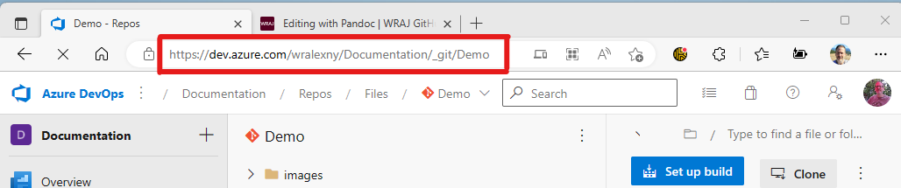

   <sub><small>_**(Example of how the URL should look)**_</small></sub>

2. <input type="checkbox" />Open the link to the repository _(see above)_
   in your web browser. _(You may need to sign in with your organization_
   _account)_

3. <input type="checkbox" />Click on the **Clone** button at the top right area

   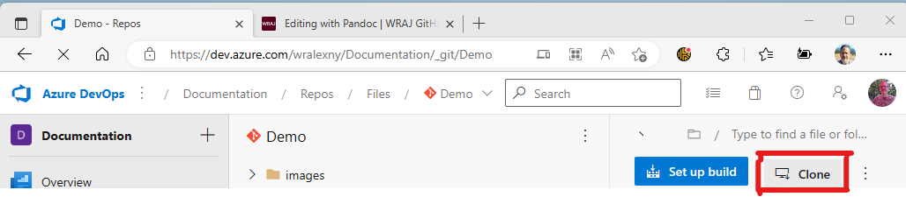

4. <input type="checkbox" />The **Clone Repository** blade opens. Under the
   **IDE** _(**i**ntegrated **d**evelopment **e**nvironment)_ section is a list
   of applications that you can use to clone the repo locally. One of those
   options is **VS Code**. Click on that title to begin the process of cloning
   to your local workstation.

   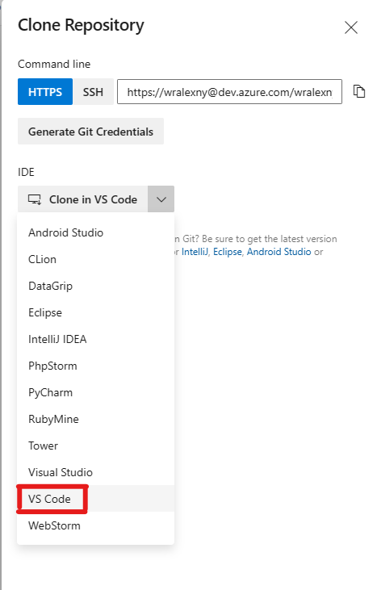

5. <input type="checkbox" />A folder dialog box will open on your workstation.
   Navigate to a local folder on your workstation that you would prefer storing
   the repo locally. You don't have to create a folder with the Repo name, this
   will create a subdirectory under the folder you choose with the name of the
   repo.

   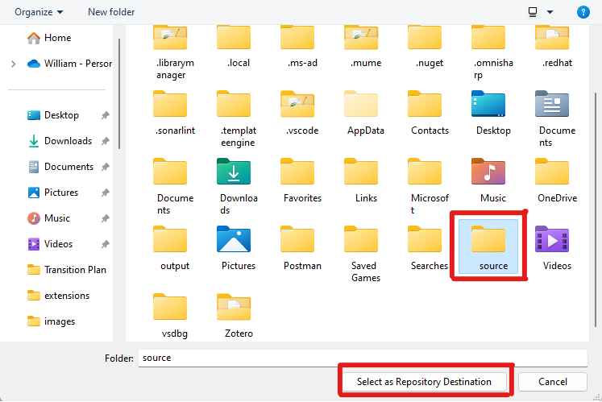

6. <input type="checkbox" />VS Code will open automatically, and you will be
   to provide credentials. Sign in with your account so that the repository is
   cloned locally to your workstation.

   

   In addition, you may also be asked to trust the author's of the file in the
   folder. You can click the checkbox to **Trust the authors...** and then click
   the **Yes, I trust the authors** button to start working on the project.

   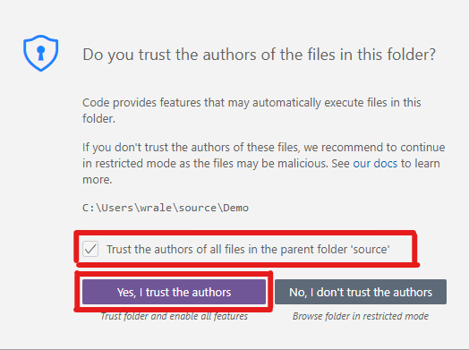

7. <input type="checkbox" />Once the project opens up in VS Code move the mouse
   over the **Folder+** Icon _(to the right of the name of the Repo)_ and click
   the mouse button to create a folder named `original` _(or whatever you
   prefer to use as a name, but for this tutorial we will be using `original`)_.
   This will be where the original document is to be stored in the project and
   placed into the repo when committed and published later.

   

8. <input type="checkbox" />For this tutorial download a sample Word Document
   file by clicking the following link:

   **Sample Word Document**

   <div style="float:left;">

   ➡️
   </div>

   <a href="../samples/public.docx" download>
   <b>public.docx</b></a>⬅️

   <div style="clear:left;"></div>

   📓
   **NOTE: <mark>Please keep the
   location of where you place the file on your workstation. It is needed for
   the next step.</mark>**

9. <input type="checkbox" />Open File Explorer Window to where the
   document was downloaded, then click and hold down the mouse button
   and drag the file into the **`original`** folder within VS Code.

   

   📓
   _Verify that the file is under the folder by collapsing the `original`
   folder and seeing if the file isn't displayed. If it is still visible then
   the file is placed in the root of the project and will need to move. If it
   does require to be moved, you can also drag the file within the VS
   Code file tree view. It will ask you to confirm it to be moved, please
   do so._

10. <input type="checkbox" />While in VS Code window press and hold **`Ctrl`**
    and **<code>&grave;</code>** _(the key to the left of the 1 key)_ for the
    **Terminal** section to open up at the bottom.

    <small>📓_You can also open this up by using the app's menu navigation_
    **_View_** ➡️ **_Terminal_**</small>

11. <input type="checkbox" />Within the Terminal windows make sure you're at the
    root directory of the project and type the following command and press the
    **Enter** key.  
    <small>_(The sample document name is used in the command line but if you have an_
    _alternate document name please replace **public** in both locations within_
    _the command)._</small>

    <i title="Copy Text" style="float:right;" class="fas fa-clipboard"
    clip-elem="convert-to-md"></i>

    ```powershell
    pandoc -s "original/public.docx" -t markdown_mmd --extract-media=images -o "public.md"
    ```
    {:id="convert-to-md"}

    📓
    _If you are in a subdirectory, like `...\orginal`, just type **`cd ..`**_
    _and press the **Enter** key to go up a directory level and type the above_
    _command._

    📓
    This will generate the new Markdown file _(**[Word Filename].md**)_ along
    with any embedded images that it could pull out of the document and place
    them into a new directory called images.

    

    

12. <input type="checkbox" />Go to the **Source Control** icon on the left side
    and in the text box, above the **✔️ Commit** button, enter
    a statement such as `Initial with Converted` and then click on the
    **✔️ Commit** button to commit the initial files _(this doesn't push it to_
    _the repo yet, that's the next step)_😃.

    

    You may receive a request **stage changes to commit**. To make it simpler
    for this and future requests I recommend clicking the **Always** button to
    not have this message appear in future commits. Otherwise, you can click the
    **Yes** button for the changes to be staged and then committed.

    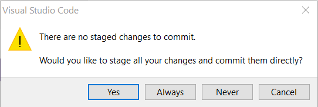

13. <input type="checkbox" />The **✔️ Commit** should have
    changed to a **Sync Changes 1 ⬆️** button. Click the **Sync Changes**
    button and this will publish your changes to the repository.

    You may receive the following dialog box after clicking the Sync button. To
    remove future dialog boxes from coming up in the future you may want to
    click the **OK, Don't Show Again** button, otherwise you can click the
    **OK** button, understanding that this message will pop up at later times.

    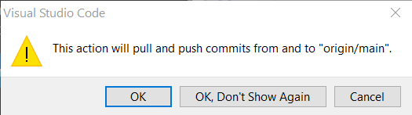

    You may also have the following appear where VS Code can try and keep in
    sync to the remote repository where it will periodically go out and do a
    fetch call to see if there have been any changes since the last time you've
    synchronized your local cloned repo to the remote repo. It might help to
    click the **Yes** button so that your local is kept up to date regularly.

    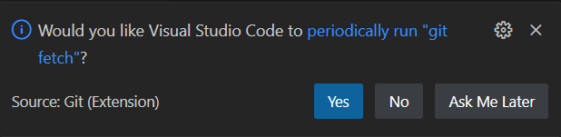

    📓
    Once the publishing of the changes are complete you may go back to DevOps
    and see all the files you've placed in the project are now also stored in
    the repository including the original document, markdown file, and any
    images.

    

That is it for initiating the conversion of the original document into a
Markdown document and posting it into a repository.

## Modifying a Document

### Markdown

I won't go into too much detail about what **Markdown** files are. There are
many online sites that can provide you with more of an explanation, but it is
basically a stripped down HTML **text** file. There are also **"flavors"** of
Markdown providing the output of those text files with minor differences. They
also have additional extensions that support these flavors to enhance the
output such as support for emojis, grid matrix tables, element attributes, etc.

If you would like to get more detail about Markdown here are a couple of links
you can find more information.

- [Markdown Guide](https://www.markdownguide.org){:target="_blank"}
  _(In depth explanation and covers a lot of material relating to Markdown..._
  _Highly recommend this site 💯**%**)_
- [Daring Fireball: Markdown](https://daringfireball.net/projects/markdown){:target="_blank"}
  _(this is **John Gruber**, the creator of Markdown, with an introduction_
  _of what Markdown is)_
- [Markdown Tutorial](https://www.markdowntutorial.com){:target="_blank"}

### Introduction of Editing Tools

VS Code is a **Source Code "Editor"** but not just for Markdown files. It's an
Open Source and free to use application and supports many code formats _(i.e._
_C#, Java, C++, HTML, Markdown, etc.)_ so it's versatile and powerful and has
many uses. However, this means that the application is not going to be an
out-of-box document editing tool that has all the "bells and whistles" that
document editing applications such as Word or Google Docs where text styles,
drag-and-drop of items, image tools, and other integrated services are built in.

With that explanation I will try and guide you to how VS Code will assist in
your development of Markdown files.

1. <input type="checkbox" />Open the ".md" file you have converted from the
   previous tasks.

   

2. <input type="checkbox" />Near the top right area of VS Code are a series of
   icons, click the first icon, it's to **Preview** the opened file.

   

   By clicking the icon you will have split sections _(known as panes)_ of what
   is currently being edited. The left pane is the actual file, then there's a
   mapping section in the middle, then a vertical scroll bar that controls the
   view of the Markdown Code file and finally the **"Preview"** pane to the
   right that also has a vertical scroll bar.

   

   📓
   Please also note that the Icons have also moved to the left pane.
   This is because they are used for editing the Markdown text file, not
   the Preview pane.

   The second, third, fourth, and fifth icons are:

   - **B**old
   - _**I**talic_
   - <b>~~S~~</b>trike-through
   - and Bullet List
  
   Each of these icons will work for an area of text you've selected in the
   editing pane.

   The last 2 icons are standard with VS Code editing that will **Split** the
   editing pane or **Show More actions...**. You can move your mouse pointer
   over each icon, and it will pop up with what they represent.

3. <input type="checkbox" />Scroll down the left pane _(edit section)_ and view
   the contents.

   **Note** how there are underlined areas under various text the editor
   detects something not quite right with the format. Move your mouse pointer
   to one of these text spots, and it will give you detail indicating what it
   detects. These are called **Linting** _(the process of using static code_
   _analysis tool identify stylistic errors in code)_ "rules". This doesn't
   indicate a true error, just a formatting rule that has become a standard.
   During the conversion of the document using Pandoc the converter doesn't
   always use the same rules that the Markdown Lint is using. This service
   can be useful if you would like to keep a standard.

   In addition to the text indicating that there's a rule issue you should also
   see that it's indicated on the mapping area _(the region between the code_
   _and the vertical scroll bar on the left pane)_. This mapping section is
   useful to show regions of the document at a quick glance. You can also click
   your mouse button in this region to move to that spot of the document in
   case it's a very long document. **BTW**, the vertical scroll bar also moves
   you through the document quickly, and it also has colored indicators that
   show you where you are and if it also detects any issues.

4. <input type="checkbox" />Scroll to line 51 _(the numbers are to the left of_
   _the editing text)_ and change line 51 & 52 with

   <i title="Copy Text" style="float:right;" class="fas fa-clipboard"
   clip-text=''></i>

   ```markdown
   
   ```

   **Before**

   

   **After**

   

   📓 _With Pandoc when you convert from Markdown to other formats, Images_
   _that use the HTML Element don't convert back. Try to change any images that_
   _use the `` element to the format shown above._

5. <input type="checkbox" />Scroll to the very top _**(line 1)**_ of the
   document and insert the following text _(Replace **[Your Name]** with your_
   _real name)_:

   <i title="Copy Text" style="float:right;" class="fas fa-clipboard"
   clip-elem="front-matter"></i>

   ```yaml
   ---
   title: 'Sample Markdown File to be converted to Word'
   author:
     - [Your Name]
   ---
   ```
   {:id="front-matter"}

   This is what they call Front Matter in Markdown. Not all Markdown Converters
   use this, but it's useful for Pandoc and DevOps to display Metadata of the
   document. This is commonly in a YAML format _(No real need to understand_
   _YAML right now)_ and the 2 Meta tags that are being put into this example.  
   They are:
   - **Title** - The Markdown Document's Title
   - **Author** - A list of Authors of the document.  
     There can be 1 or more names by just placing a carriage return after each,
     then 2 spaces, a hyphen, then space and a Name.

6. <input type="checkbox" />Go through the rest of the document and make any
   changes or additions to it and when finished commit and publish the changes
   to the repository as you completed in the conversion task above.

   1. <input type="checkbox" />Go to the **Source Control** icon on the left
      side and in the text box, above the **✔️ Commit** button, enter
   a statement such as `Updated Markdown document` and then click on the
   **✔️ Commit** button to commit the initial files.

   2. <input type="checkbox" />The **✔️ Commit** should have
    changed to a **Sync Changes 1 ⬆️** button, click the button to complete
    your changes to the repository.

That concludes the document modification task of this tutorial. Please take some
time to get familiar with VS Code and/or Markdown. Also visit some
recommended links mentioned above to get familiar with the Markdown language.
After a while you may see why Markdown has become a great way to create and
publish documents.

## Create Publications

Now that you have become familiar with Markdown and you are ready to create a
Document, or Web page, or PDF, or all the above, then we can proceed with the
next couple of steps to generate those results. In this section we will use
Pandoc which is a free software product available and has the capability of
converting documents to and from various formats. We will be using the Markdown
file in VS Code from the tasks above and will generate a Word Document and also
as a Web Page.

1. <input type="checkbox" />Open VS Code with the same project that you were
   working on from the previous exercise.
2. <input type="checkbox" />Download the following YAML file:

   **Public Default Writer File**

   <div style="float:left;">

   ➡️
   </div>

   <a href="resources/default-public.yaml" download>
   <b>default-public.yaml</b></a>⬅️

   <div style="clear:left;"></div>

   📓
   **NOTE: <mark>Please keep the
   location of where you place the file on your workstation. It is needed for
   the next step.</mark>**

3. <input type="checkbox" />Click and drag the **default-public.yaml** from the
   downloaded location into the root of the VS Code Project just like you did
   with the **public.docx** file in the previous task, except this file should
   be placed in the root of the project, not a sub-folder _(it may help if you_
   _collapse all the directories in the tree view in VS Code)_.

   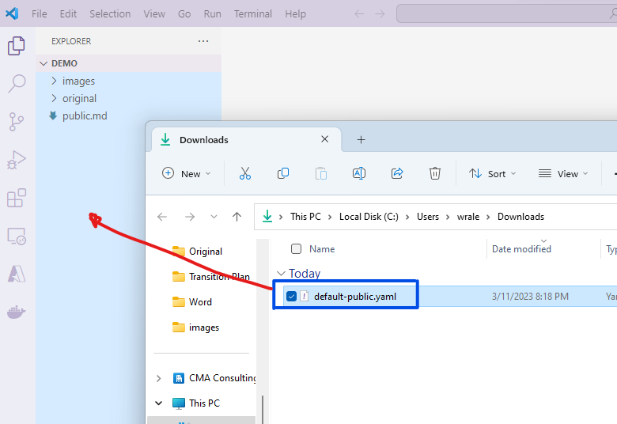

   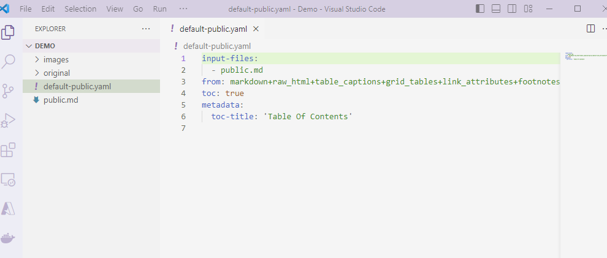

4. <input type="checkbox" />If not already open, click on the new YAML file so
   that you can view the contents.

   The content file contains parameters that will be used during the Pandoc
   conversion for generating both a Word Document and a Web Page.

   <u>File contents:</u>

   ```yaml
   input-files:
     - public.md
   from: markdown+raw_html+table_captions+grid_tables+link_attributes+footnotes+emoji
   toc: true
   metadata:
     toc-title: 'Table Of Contents'
   ```

   - **Input Files**

     The first parameter is **`input-files`**. This can be 1 or more Markdown
     files. If you have more than 1 file it "stitches" the files together into 1
     result. It also puts them in order that the files shown in the listing.

   - **From**

     The **`from`** parameter is describing the format of the originating
     document. This is all in 1 string sent to the writer portion of Pandoc. In
     this version we will be using **`markdown`** with the following additional
     extensions _(more extensions can be added by looking them up at_
     _[Pandoc's User Guide](https://pandoc.org/MANUAL.html#pandocs-markdown)_
     _and using the plus sign (`+`) in front of the new extension)_:
     - **`raw_html`** - allows HTML elements which are not representable in
       Pandoc’s AST to be parsed as raw HTML. By default, this is disabled for
       HTML input.
     - **`table_captions`** - A caption may optionally be provided with all 4
       kinds of tables. A caption is a paragraph beginning with the string
       `Table:` (or `table:` or just `:`), which will be stripped off. It may
       appear either before or after the table.
     - **`grid_tables`** - The cells of grid tables may contain arbitrary block
       elements (multiple paragraphs, code blocks, lists, etc.).
     - **`link_attributes`** - For HTML and EPUB, all known HTML5 attributes
       except `width` and `height` (but including `srcset` and `sizes`) are
       passed through as is. Unknown attributes are passed through as custom
       attributes, with data-prepended. The other writers ignore attributes that
       are not specifically supported by their output format.
     - **`footnotes`** - Pandoc’s Markdown allows footnotes, using the following
       syntax:

       ```markdown
       Here is a footnote reference,[^1] and another.[^longnote]

       [^1]: Here is the footnote.

       [^longnote]: Here's one with multiple blocks.

         Subsequent paragraphs are indented to show that they
         belong to the previous footnote.

         { some.code }

          The whole paragraph can be indented, or just the first
          line.  In this way, multi-paragraph footnotes work like
          multi-paragraph list items.
       ```
     - **`emoji`** - Parses textual emojis like `:smile:` (😄) as
       Unicode emoticons.

       If you want to find out more information you can view
       [Pandoc's User Guide relating to Markdown]

   - **TOC (Table of Contents)**

     The last section of parameters relates to generating a Table of Contents.
     This will be placed after the title of the document
     _(and subtitle and/or author if these are in the front-matter of the_
     _document)_ and before the body of the document. In the
     sample YAML file we are asking that the `toc` _(table of contents)_ is
     included (`true`) and in the metadata section we are specifying the heading
     name to use will be **Table Of Contents**.

5. <input type="checkbox" />Download the files below.

   <ul>
     <li>
      <div style="float:left;">

      ➡️
      </div>

      <a href="resources/.gitignore" download>
      <b>.gitignore</b></a>⬅️

      <div style="clear:left;"></div>
     </li>
     <li>
      <div style="float:left;">

      ➡️
      </div>

      <a href="resources/Create-HTML.ps1" download>
      <b>Create-HTML.ps1</b></a>⬅️

      <div style="clear:left;"></div>
     </li>
     <li>
      <div style="float:left;">

      ➡️
      </div>

      <a href="resources/Create-Word.ps1" download>
      <b>Create-Word.ps1</b></a>⬅️

      <div style="clear:left;"></div>
     </li>
   </ul>

   <small>❗
   **_<mark>Please note where these files are placed since they will
   be used in the next couple of steps</mark>_**</small>

6. <input type="checkbox">Move the 3 files into the VS Code project at the root
   level _(just like you did with the `default-public.yaml` file above)_.

   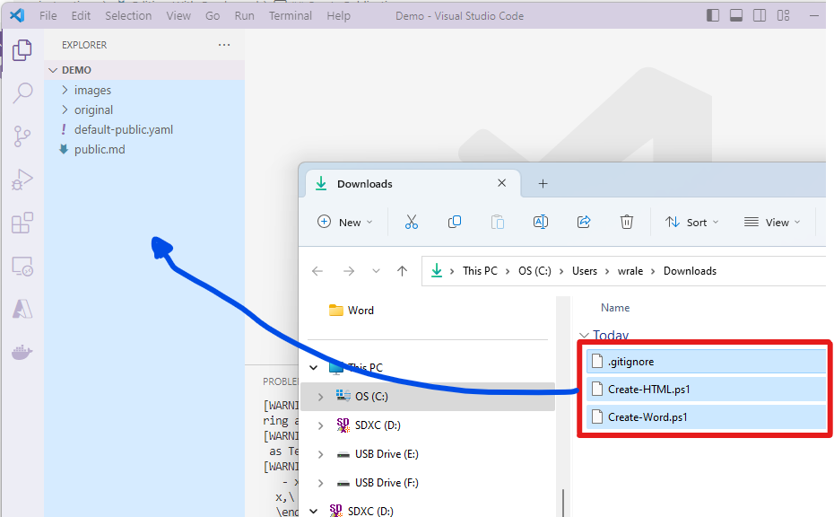

   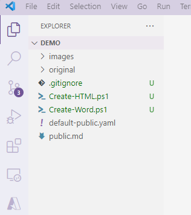

   The three files are:

   1. **`.gitignore`** - This file is used by the GIT source control that allows
      for folders and/or files to be ignored for commits and checking into repos.
      For the purposes of this tutorial there's an output folder that will be
      created where the resulting files are generated and since these are based
      on the actual Markdown file there is no need for the resulting outputs to
      be kept in source management. Normally those would be stored as an
      artifact during the building and deployment. For our purposes we will be
      building the outputs locally and will not need to check the results in.
   2. **`Create-HTML.ps1`** - This is a PowerShell script file that has multiple
      commands that will generate subfolders and then execute a command to
      run the Pandoc process to convert the Markdown text file into a single
      HTML file with images embedded within that HTML file. We'll execute and
      see this output in a couple of steps below.
   3. **`Create-Word.ps1`** - Just like the PowerShell script file above this
      will generate a Microsoft Word document with similar results as the HTML
      document. This should have a close to original output as the original
      file used to begin with.

7. <input type="checkbox" />Open a **Terminal** window in VS Code by holding down
   the **`Windows(🪟)`** and **<code>&grave;</code>** _(the key to the left of the_
   _1 key)_.

   <small>📓_You can also open this up by using the VS Code's menu navigation_
   **_View_** ➡️ **_Terminal_**</small>

8. <input type="checkbox" />Make sure that the terminal window is using
   PowerShell as its Terminal window. If you look to the top right section of
   window it should look like

   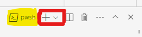

   <small>📓
   Note the highlighted part of the image shows the current terminal
   session. If PowerShell _(pwsh)_ isn't displayed then click on the down arrow
   right of the `+` button and select **PowerShell**.</small>

### Generate Word

Type the following command into the terminal window and then press **Enter**:

<i title="Copy Text" style="float:right;" class="fas fa-clipboard"
clip-elem="create-word"></i>

```powershell
.\Create-Word.ps1
```
{:id="create-word"}

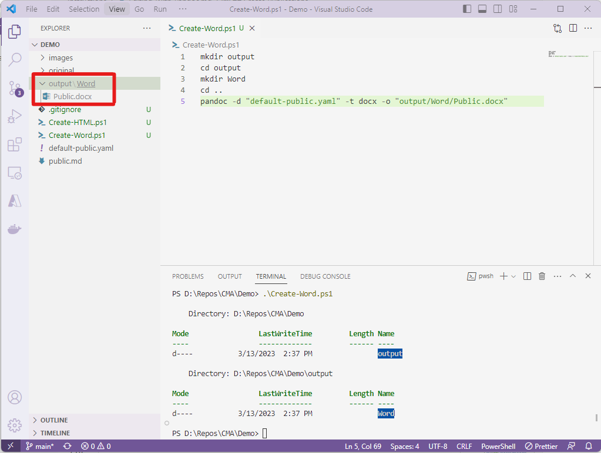

If you open the `Create-Word.ps1` file in the editor you can see what is
occurring.

1. Creates a subdirectory **output** at the root of the project
   _(`mkdir output`)_.
2. Moves into that subdirectory _(`cd output`)_.
3. Creates another subdirectory **Word** that will be used to place the
   Microsoft Word resultant file within _(`mkdir Word`).
4. Goes back out to the root folder _(`cd..`)_.
5. Finally, runs a **pandoc** command line with arguments that will use
   the **default-public.yaml** file parameters along with additional
   parameters specific to generating a Word Document that will be placed in
   the newly created subdirectories from the commands above  
   _(`pandoc -d "default-public.yaml" -t docx -o "output/Word/Public.docx"`)_.

   <small>📓
   _Notice that the file names are surrounded by double quotes._
   _This is to make sure that the argument `-d` and `-o` being sent to the_
   _pandoc engine as its associated values contained within those quotes._
   _This is especially useful in case the subdirectories or file names_
   _contain spaces and without those quotes the values being sent won't be_
   _valid and the command would error._</small>

You may open a File Explorer and navigate to the directory where the new
document was generated and open it from there. If you compare it to the
original document _(under the **original** directory)_ you should see
that the contents are almost identical except that in the new document it
used the metadata to creates a **Title**, **Author**, and a generated
**Table Of Contents** due to the parameters within the
**default-public.yaml** file.


You can experiment with other options and
re-run the same PowerShell Script _(just ignore any errors that may come up
because those subdirectories were already created)_.

### Generate HTML

You can also generate the HTML version of this document by executing

<i title="Copy Text" style="float:right;" class="fas fa-clipboard"
clip-elem="create-html"></i>

```powershell
.\Create-HTML.ps1
```
{:id="create-html"}

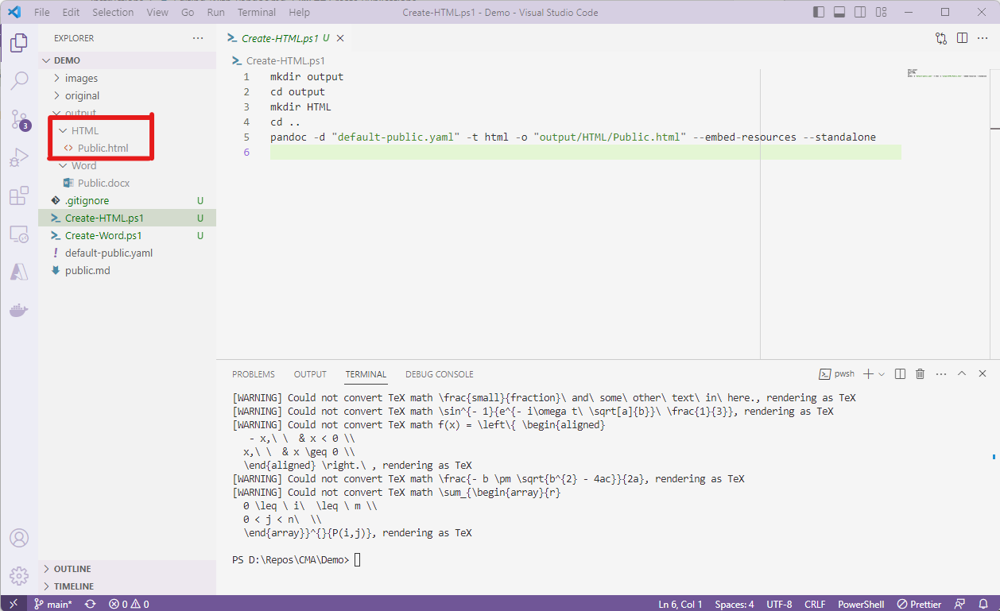

Ignore any warnings or errors that may come up on the screen. Again
you can navigate to the folder with your File Explorer and open up the HTML
document to see that the contents are now in an HTML format.

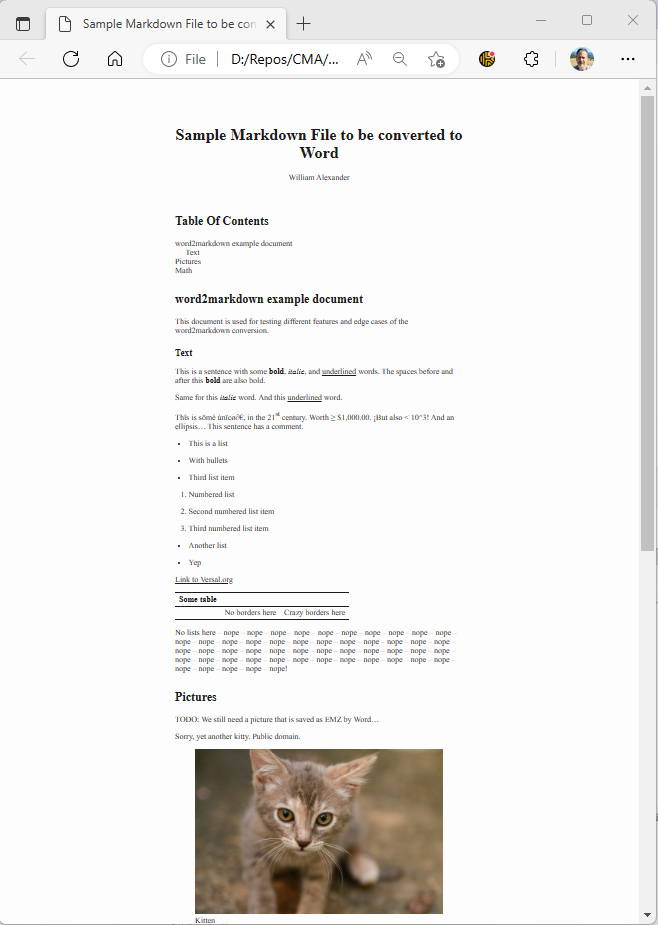{:height = "400px"}

You may now commit and publish the project back to your repository and view the
files within the repo to confirm that the main contents have been checked in.

This should conclude the section to create the publication. You may edit and
work with these files to get a better understanding of the conversion efforts.

Thank You for visiting this tutorial and I hope you have success in editing
in the future.

[GIT]: https://git-scm.com/about "git --local-branching-on-the-cheap"
[GIT Downloads]: https://git-scm.com/downloads "git --fast-version-control"
[VS Code]: https://code.visualstudio.com "Microsoft's Visual Studio Code"
[Pandoc]: https://pandoc.org "Pandoc, a universal document converter"
[Install Pandoc]: https://pandoc.org/installing.html "Download and install Pandoc"
[Pandoc's User Guide relating to Markdown]: https://pandoc.org/MANUAL.html#pandocs-markdown
[GIT Logo]: https://git-scm.com/images/logo@2x.png
[VS Code Logo]: data:image/jpeg;base64,/9j/4AAQSkZJRgABAQAAAQABAAD/2wCEAAYGBgYHBgcICAcKCwoLCg8ODAwODxYQERAREBYiFRkVFRkVIh4kHhweJB42KiYmKjY+NDI0PkxERExfWl98fKcBBgYGBgcGBwgIBwoLCgsKDw4MDA4PFhAREBEQFiIVGRUVGRUiHiQeHB4kHjYqJiYqNj40MjQ+TERETF9aX3x8p//CABEIAC4ALgMBIgACEQEDEQH/xAAaAAACAwEBAAAAAAAAAAAAAAAGBwAFCAME/9oACAEBAAAAANRyLAOZdMwVOqDSF6p56EDhDn4Khy1wa5DEBz7derT0gYrHP//EABgBAQADAQAAAAAAAAAAAAAAAAUCAwQG/9oACgICEAMQAAAA05UjFxIzpuTL4bv2gmwf/8QAMxAAAgEDAgMECAYDAAAAAAAAAQIDAAQFBhIRMVETIUFCByIjMlJhYsEQICRxdKElcoH/2gAIAQEAAT8A/HV2uhbdpYYqUGbvWa5Hk6rH9XU1p7NZKzg3w3L98jcQx3Kf3BrHa0tJQVvYzC4HvLxZD9xV16SbaPJdnBadrZKeDS8pG+pBVhkLPI2qXNpOskTeYeBHMMDyIrWWvVlEmOxEvs+U90vn6rH9PU0m+R44oo2eR2CoiDczE+AAoYq+xKR214qrMyCUoDu2B+QJ61urWWiQEuMnjFVQoMlxByHAc3T7io7u5ihuIYriVI502yqjEB16GsZh8llb+Oys41eRwTuZtqKo5s1aY0djcBH2i+3vGXhJcsP6QeVa1uf86f48dbq1nrqfOu9pbExY9W93k0xHmf7CsDpTUOWsZru3tv06LxiLna0x6RUk09tOrozxTRP3EcVdGX+wRWlfSHDc7LPLusc3JLnkj/7/AAmtdnhnj/GirdV7oHTV9mBk57Ql+O54QeEMj/E60AAAAAAAAAO4ACtY6KhzKPeWgWO/A/ZZgPB/n0NXEU9tPLBPE0csbFXRxwKkeBqyuZprWPtZWfZ6ibiTtReSj5Ct4/Jq3RtnqCDtE2w3yLwim8GHwSdRWkdIXmVilDXUUMUUpDkAu/8AwEAViNM4fFKewtw0hXg00nrua//EACYRAAIBAwMCBwEAAAAAAAAAAAECAwAEEQUhMSJBEiQyUWFz4cH/2gAIAQIBAT8AmtLiBUaSMqG4NWOncSzD5Cn+09ha3USsV3I2deas3eK1UXjrjYDxdvYGtWtrsx5hOY8dSjn9Faevkbb6xTyyOFDuSFGBk8VperGErDOSY+Fbuv5V5qtrZ9GC0mPSNq//xAAlEQACAgICAAUFAAAAAAAAAAABAgMEABEFMRIhMkHhQlFhc8H/2gAIAQMBAT8Agu1p3dI5QxXsZf5PuKBvwXH8xOQt1JWUMdA+aN1l1I5rTNSRtgEnw+/3Izh7VNZdTjUv0sevg5yLavWf2HEiijLFEVSx2dDvOW4dZw08AAk7Zeg3zlPiLd0l9hI9+snef//Z
[Markdown Extensions Pack Logo]: https://bat67.gallerycdn.vsassets.io/extensions/bat67/markdown-extension-pack/0.7.0/1614239921497/Microsoft.VisualStudio.Services.Icons.Default
[Markdown Extensions Pack]: https://marketplace.visualstudio.com/items?itemName=bat67.markdown-extension-pack
[GitHub Markdown Preview]: https://marketplace.visualstudio.com/items?itemName=bierner.github-markdown-preview
[GitHub Markdown Preview Logo]: https://bierner.gallerycdn.vsassets.io/extensions/bierner/github-markdown-preview/0.3.0/1651533762167/Microsoft.VisualStudio.Services.Icons.Default
[LTeX–Grammar & Spell Checking Logo]: https://znck.gallerycdn.vsassets.io/extensions/znck/grammarly/0.23.12/1675361647811/Microsoft.VisualStudio.Services.Icons.Default
[LTeX–Grammar & Spell Checking]: https://marketplace.visualstudio.com/items?itemName=valentjn.vscode-ltex
[Azure Tools Logo]: https://ms-vscode.gallerycdn.vsassets.io/extensions/ms-vscode/vscode-node-azure-pack/1.1.1/1667846329462/Microsoft.VisualStudio.Services.Icons.Default
[Azure Tools]: https://marketplace.visualstudio.com/items?itemName=ms-vscode.vscode-node-azure-pack
[Prettier Logo]: https://esbenp.gallerycdn.vsassets.io/extensions/esbenp/prettier-vscode/9.10.4/1673460374911/Microsoft.VisualStudio.Services.Icons.Default
[Prettier]: https://marketplace.visualstudio.com/items?itemName=esbenp.prettier-vscode
