## Description

The following method will assist in getting tools ready for editing documents,
in just about any format, and make trackable changes within those document(s).
In this page I make use of Markdown since it's become a standard for many
technical writers today. I will also use a source management system to check
in my edited files. For this page I use **Microsoft's Azure DevOps** for
as a repository storage and building platform to create artifacts.

1. [][GIT]<span
   style="color: grey;"> version control _(btw, full name is **Global information Tracker**)_</span>
2. [ Visual Studio Code][Visual Studio Code] <span style="color: grey;">_(a.k.a. **VS Code**)_ for editing the documents</span>
3. [Pandoc] <span style="color: grey;">a universal document converter</span>

## Basic Tools

### Get the Tools

   Download and install these 3 tools onto your desktop.

1. <input type="checkbox" />[GIT][GIT Downloads]
2. <input type="checkbox" />[Pandoc][Install Pandoc]
3. <input type="checkbox" />[Visual Studio Code]

### Configure the Tools

1. **GIT**

   After installation of the GIT Client on your workstation, there are global
   parameters that required to be set. These parameters are used for tracking
   work you've contributed upon posting changes to a repository
   _(a.k.a. **repo**)_. Without these paramters set, you will experience errors.

   1. Verify that you have installed **GIT** on your workstation by completing
      the following steps:  
      1. <input type="checkbox" />Press and hold both the **`Windows Key`🪟**
         along with **`R`** on your keyboard.

         📓 _This will open a **`Run`** dialog box requesting you to type a_
         _command into a textbox._

      2. <input type="checkbox" />Type **`cmd`**<i title="Copy Text"
         class="fas fa-clipboard" clip-text='cmd'></i> in the textbox and press
         the `Enter` key.

         📓 _This will open a new command window with a prompt._

      3. <input type="checkbox" />Type **`git --version`**<i title="Copy Text"
         class="fas fa-clipboard" clip-text='git --version'></i> at the prompt
         and press the `Enter` key.

         📓 _You should get a response showing the GIT version installed on_
         _your workstation. If you did not get a version, or you received an_
         _error message, please install/re-install the GIT application and_
         _complete the above steps._

      4. **Keep the command window open for the next task.**

   2. In the command window type in the below commands **_(replace
      `[Your Name]` and `[Your Email]` with your information)_**.

      ❗ _If you have closed the command window please do the steps in the_
      _previous task to re-open the command window._

      1. <input type="checkbox" />Set **User Name**

         Type the following text  _(replace **`[Your Name]`**)_ and press the
         `Enter` key.

         <i title="Copy Text" style="float:right;" class="fas fa-clipboard"
         clip-text='git config --global user.name "[Your Name]"'></i>

         ```powershell
         git config --global user.name "[Your Name]"
         ```

      2. <input type="checkbox" />Set **User Email Address**

         Type the following text _(replace **`[Your Email]`**)_ and press the
         `Enter` key.

         <i title="Copy Text" style="float:right;" class="fas fa-clipboard"
         clip-text='git config --global user.email "[Your Email]"'></i>

         ```powershell
         git config --global user.email "[Your Email]"
         ```

   3. Close the command window.

2. **VS Code**

   VS Code does contain basic **Markdown** editing capabilities without the
   following extension pack, but these additional features will assist in many
   advanced markdown editing such as support of formulas, images, checkboxes,
   tables, emojis, and more.

   1. <input type="checkbox" />Open a browser window by clicking on the
      following button.

        <button onclick="window.open('https://marketplace.visualstudio.com/items?itemName=bat67.markdown-extension-pack', '_blank');">
          
          Markdown Extensions Pack</button>

   2. <input type="checkbox" />On the new browser page click the **`Install`**
      button.

      VS Code should open up with the same web page displayed in a tab of the
      main window.

   3. <input type="checkbox" />Click the **`Install`** button again on the page.

      This should now show that it's instaling the additional Markdown editing
      features. In a couple of minutes you can open the Extension Viewer to see
      the new features. Within the extensions view you may click each feature
      and read more details about each which may also provide how best to use
      each.

   4. <input type="checkbox" />Install the following VS Code features by
      clicking the buttons below and follow the methods as in the previous steps.

      <ul>
        <li><button style="width:200px;text-align:left;" onclick="window.open('https://marketplace.visualstudio.com/items?itemName=bierner.github-markdown-preview', '_blank');">
          
          GitHub Markdown Preview</button></li>
        <li><button style="width:200px;text-align:left;" onclick="window.open('https://marketplace.visualstudio.com/items?itemName=ms-vscode.vscode-node-azure-pack', '_blank');">
          
          Azure Tools</button></li>
        <li><button style="width:200px;text-align:left;" onclick="window.open('https://marketplace.visualstudio.com/items?itemName=esbenp.prettier-vscode', '_blank');">
          
          Prettier</button></li>
      </ul>

3. **Pandoc**

   There really aren't any configuration settings for Pandoc. Just verify that
   the tool has been installed by executing the following steps.

   1. <input type="checkbox" />Press and hold both the **`Windows Key`🪟**
      along with **`R`** on your keyboard.

      📓 _This will open a **`Run`** dialog box requesting you to type a_
      _command into a textbox._

   2. <input type="checkbox" />Type **`cmd`**<i title="Copy Text"
      class="fas fa-clipboard" clip-text='cmd'></i> in the textbox and press
      the `Enter` key.

      📓 _This will open a new command window with a prompt._

   3. <input type="checkbox" />Type **`pandoc --version`**<i title="Copy Text"
      class="fas fa-clipboard" clip-text='pandoc --version'></i> at the prompt
      and press the `Enter` key.

      📓 _You should get a response showing the version of Pandoc installed on_
      _your workstation. If you did not get a version, or you received an_
      _error message, please install/re-install Pandoc and_
      _complete the above steps._

   4. <input type="checkbox" />Close the command window.

## Create a New Repo and Populate

If this is a new Repository that will be used please start here, otherwise skip
this section and begin with [Modifying a Document](#modifying-a-document)
below.

1. <input type="checkbox" />Have a DevOps Project Administrator create a new
   Repository for the document.

   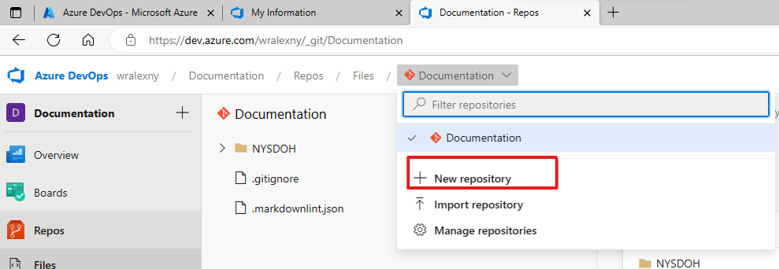

2. <input type="checkbox" />Open the link to the Repository created and click
   the `Clone in VS Code` button.

   📓 _If the `Clone in VS Code` is not shown by default when this screen is
   opened, click the dropdown icon on the right of the button and select it
   from the selections._

   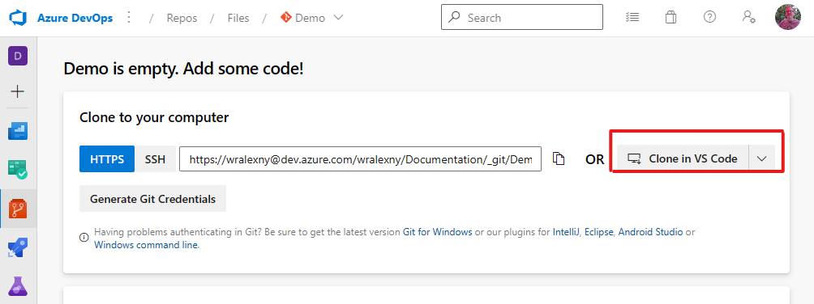

3. <input type="checkbox" />VS Code will open automatically and you will be
   to provide credentials. Sign in with your account so that the repository is
   cloned locally to your workstation.

   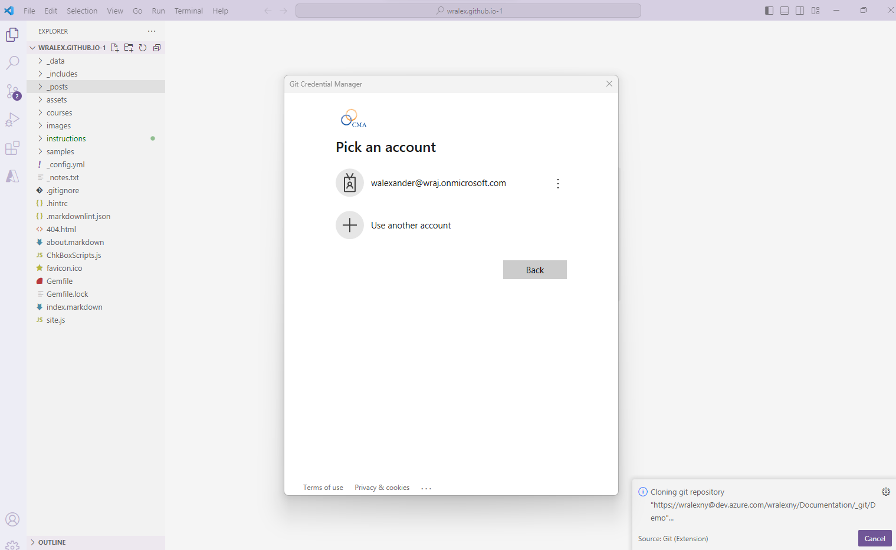

4. <input type="checkbox" />Once the project opens up in VS Code move the mouse
   over the **Folder+** Icon _(to the right of the name of the Repo)_ and click
   the mouse button to create a folder named `original` _(or whatever you
   prefer to use as a name, but for this tutorial we will be using `original`)_.
   This will be where the orignal document is to be stored in the project and
   okaced into the repo when commited and published later.

   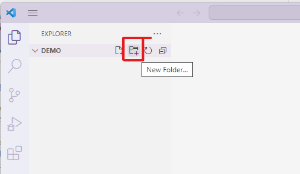

5. <input type="checkbox" />For this tutorial download a sample Word Document
   file by clicking the following link:

   **Sample Word Document**

   **[public.docx](../samples/public.docx)**

   📓**NOTE: <mark>Please keep the
   location of where you place the file on you're workstation. It is needed for
   the next step.</mark>**

6. <input type="checkbox" />Open File Explorer Window to where the
   document was downloaded, then click and hold down the mouse button
   and drag the file into the **`original`** folder within VS Code.

   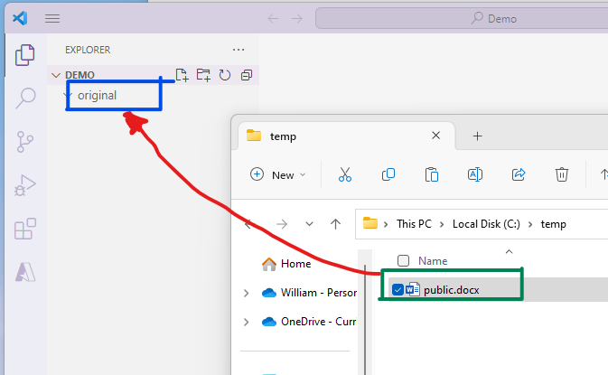

   📓 _Verify that the file is under the folder by collapsing the `original`
   folder and seeing if the file isn't displayed. If it is still visible then
   the file is placed in the root of the project and will need to move. If it
   does require to be moved, you can also drag the file within the VS
   Code file tree view. It will ask you to confirm it to be moved, please
   do so._

7. <input type="checkbox" />While in VS Code window press and hold **`Ctrl`**
   and **<code>&grave;</code>** _(the key to the left of the 1 key)_ for the
   **Terminal** section to open up at the bottom.

   📓 _You can also open this up by using the app's menu navigation **View**_
   ➡️ _**Terminal**_

8. <input type="checkbox" />Within the Terminal windows make sure you're at the
   root directory of the project and type the following command _(replace_
   _**[Word Filename]** with the actual file name of the document in both_
   _locations)_ and press the **Enter** key:

   <i title="Copy Text" style="float:right;" class="fas fa-clipboard" clip-text=
   'pandoc -s "original/[Word Filename].docx" -t markdown_mmd --extract-media=images -o "[Word Filename].md"'></i>

   ```powershell
   pandoc -s "original/[Word Filename].docx" -t markdown_mmd --extract-media=images -o "[Word Filename].md"
   ```

   📓 _If you are in a sub-directory, like `...\orginal`, just type **`cd ..`**_
   _and press the **Enter** key to go up a directory level and type the above_
   _command._

   📓 This will generate the new Markdown file _(**[Word Filename].md**)_ along
   with any embeded images that it could pull out of the document and place
   them into a new directory called images.

   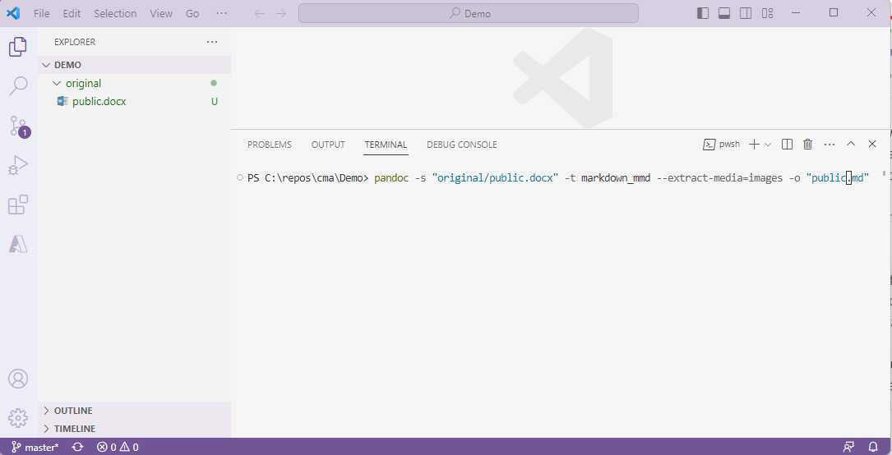

   

9. <input type="checkbox" />Go to the **Source Control** icon on the left side
   and in the textbox, above the **✔️ Commit** button, enter
   a statement such as `Initial with Converted` and then click on the
   **✔️ Commit** button to commit the initial files _(this doesn't push it to_
   _the repo yet, that's the next step )_😃.

   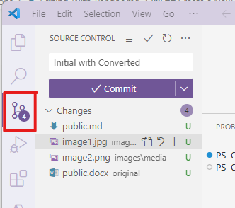

10. <input type="checkbox" />The **✔️ Commit** should have
    changed to a **Sync Changes 1 ⬆️** button that you will click and this will
    publish your changes to the repository.

    📓 Once the publishing of the changes are complete you may go back to DevOps
    and see all of the files you've placed in the project are now also stored in
    the repository including the original document, markdown file, and any
    images.

    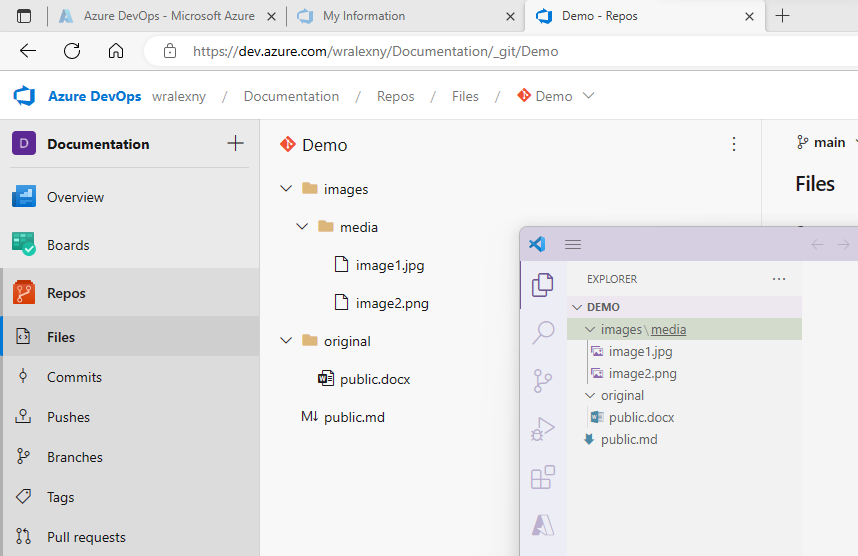

That is it for initating the conversion of the original document into a Markdown
document and posting it into a repository.

## Modifying a Document

### Markdown

I won't go into too much detail about what **Markdown** files are. There are
many online sites that can provide you with more of an explanation but it is
basically a stripped down HTML **text** file. Ther are also  **"flavors"** of
Markdown providing the output of those text files with minor differences. They
also have addititional extensions that support these flavors to enhance the
output such as support for emojis, grid matrix tables, element attributes, etc.

If you would like to get more detail about Markdown here are a couple of links
you can find more information.

- [Markdown Guide](https://www.markdownguide.org) _(In depth explanation and_
  _covers a lot material relating to Markdown... Highly recomend this site 💯 **%**)_
- [Daring Fireball: Markdown](https://daringfireball.net/projects/markdown) 
  _(this is **John Gruber**, the creator of Markdown, with an introduction_
  _of what Markdown is)_
- [Markdown Tutorial](https://www.markdowntutorial.com)

### Introduction of Editing Tools

VS Code is a **Source Code "Editor"** but not just for Markdown files. It's an
Open Source and free to use application and supports many code formats _(i.e._
_C#, Java, C++, HTML, Markdown, etc.)_ so it's versatile and powerful and has
many uses. However, this means that the application is not going to be an
out-of-box document editing tool that has all the "bells and whistles" that
document editing applications such as Word or Google Docs where text styles, drag-and-drop of items, image tools, and other integrated services are built in.

With that explaination I will try and guide you to how VS Code will assist in
your development of Markdown files.

1. <input type="checkbox" />Open the ".md" file you have converted from the
   previous tasks.

   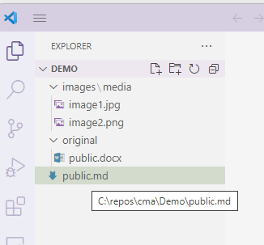

2. <input type="checkbox" />Near the top right area of VS Code are a series of
   icons, click the first icon, it's to **Preview** the opened file.

   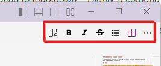

   By clicking the icon you will have split sections _(known as panes)_ of what
   is currently being edited. The left pane is the actual file, then there's a
   mapping section in the middle, then a vertical scroll bar that controlls the
   view of the Markdown Code file and finally the **"Preview"** pane to the
   right that also has a vertical scroll bar.

   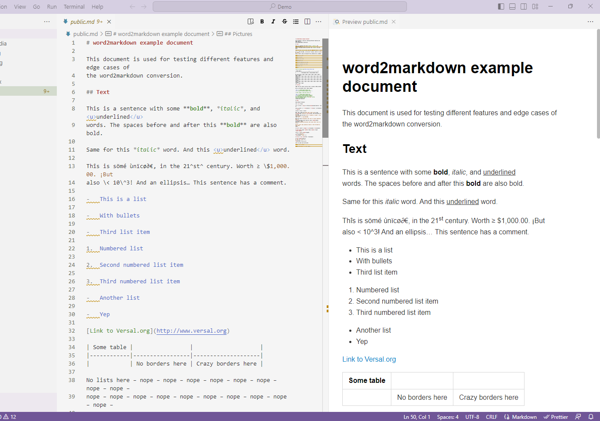

   📓Please also note that the Icons have also moved to the left pane.
   This is because they are used for editing the Markdown text file, not
   the Preview pane.

   The second, third, fourth, and fifth icons are:

   - **B**old
   - _**I**talic_
   - <b>~~S~~</b>trike-through
   - and Bullet List
  
   Each of these icons will work for an area of text you've selected in the
   editing pane.

   The last 2 icons are standard with VS Code editing that will **Split** the editing pane or **Show More actions...**. You can move your mouse pointer
   over each icon and it will pop up with what they represent.

3. <input type="checkbox" />Scroll down the left pane _(edit section)_ and view
   the contents.

   **Note** how there are unerderlined areas under various text the editor
   detects something not quite right with the format. Move your mouse pointer
   to one of these text spots and it will give you detail indicating what it
   detects. These are called **Linting** _(the process of using static code_
   _analysis tool identify stylistic errors in code)_ "rules". This doesn't
   indicate a true error, just a formating rule that has become a standard.
   During the conversion of the document using Pandoc the converter doesn't
   always use the same rules that the Markdown Lint is using. This service
   can be useful if you would like to keep a standard.

   In addition to the text indicating that there's a rule issue you should also
   see that it's indicated on the mapping area _(the region between the code_
   _and the vertical scroll bar on the left pane)_. This mapping section is
   useful to show regions of the document at a quick glance. You can also click
   your mouse button in this region to move to that spot of the document in
   case it's a very long document. **BTW**, the vertical scroll bar also moves
   you through the document quickly and it also has colored indicators that show
   you where you are and if it also detects any issues.

4. <input type="checkbox" />Scroll to line 51 _(the numbers are to the left of_
   _the editing text)_ and change line 51 & 52 with

   <i title="Copy Text" style="float:right;" class="fas fa-clipboard"
   clip-text=''></i>

   ```markdown
   
   ```

   **Before**

   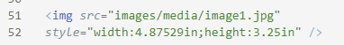

   **After**

   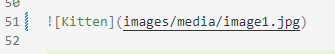

   📓 _With Pandoc when you convert from Markdown to other formats, Images_
   _that use the HTML Element don't convert back. Try to change any images that_
   _use the `` element to the format shown above._

5. <input type="checkbox" />Scroll to the very top _**(line 1)**_ of the
   document and insert the following text _(Replace **[Your Name]** with your_
   _real name)_:

   <i title="Copy Text" style="float:right;" class="fas fa-clipboard"
   clip-text="---\ntitle: 'Sample Markdown File to be converted to Word'\nauthor:\n  -[Your Name]\n---"></i>

   ```yaml
   ---
   title: 'Sample Markdown File to be converted to Word'
   author:
     - [Your Name]
   ---
   ```

   This is what they call Front Matter in Markdown. Not all Markdown Converters
   use this but it's useful for Pandoc and DevOps to display Metadata of the
   document. This is commonly in a YAML format _(No real need to understand_
   _YAML right now)_ and the 2 Meta tags that are being put into this example.  
   They are:
   - **Title** - The Markdown Document's Title
   - **Author** - A list of Authors of the document.  
     There can be 1 or more names by just placing a carriage return after each,
     then 2 spaces, a hyphen, then space and a Name.

[GIT]: https://git-scm.com/about "git --local-branching-on-the-cheap"
[GIT Downloads]: https://git-scm.com/downloads "git --fast-version-control"
[Visual Studio Code]: https://code.visualstudio.com "Microsoft's Visual Studio Code"
[Pandoc]: https://pandoc.org "Pandoc, a universal document converter"
[Install Pandoc]: https://pandoc.org/installing.html "Download and install Pandoc"
